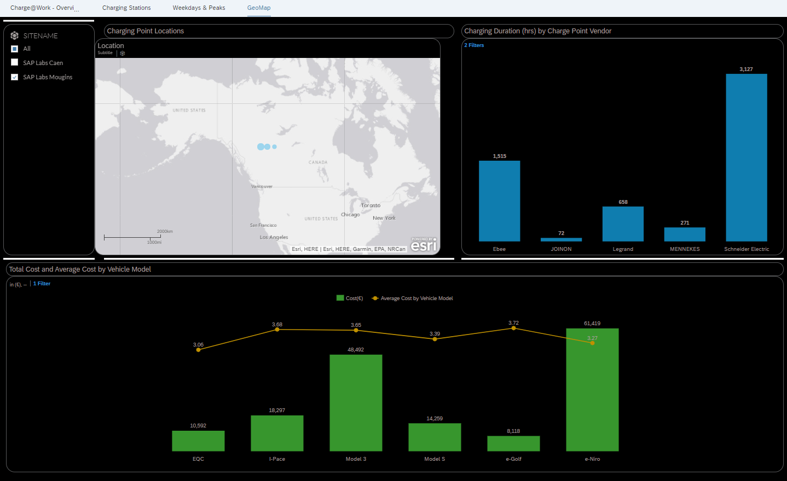

# Exercise 0 - Architecture and Overview

In this exercise you will learn about the architecture implemented in this hands-on workshop.

The following topics are for your  **``information and reference only ``** and refer to data movement, integration and preparation in the overall scheme of the workshop. You will not have access to these components during the workshop.

 
  - [0.1 - REST API integration SAP Data Intelligence](#01---rest-api-integration-sap-data-intelligence)
  - [0.2 - Federate Historical data from DataLake](#02---federate-historical-data-from-datalake)
  - [0.3 - S/4 User Data Integration](#03-s4-user-data-integration)
  
   

## 0 - Workshop Architecture

 

 

<!-- ## Exercise 0.2 - SAP Data Intelligence -->
## 0.1 - REST API integration SAP Data Intelligence 

SAP Data Intelligence ``Graph`` is a network of ``operators`` connected to each other using typed input ports and output ports for data transfer where users can define and configure the operators in a graph.

In our hands-on workshop we have used the custom Python Operator with custom ``eMobility API ``calls to consume and transform API data that are staged in ``SAP Hana Cloud``.

The workshop is not focused on Data Pipelining and consumption, this is merely background information on data origin.

 

Data Intelligence Launchpad is a central access point for various tool sets within the Data Intelligence Suite. The Modeler is the tool set used to create Graphs (Data Pipelines).

``Customizable Python`` operator with custom API calls and data transformation.

Example of eMobility API call with standard Python requests.

SAP Hana Cloud Operator configuration attributes.

 

## 0.2 - Federate Historical data from DataLake

eMobility historical data is loaded into the Data Lake via a Data Intelligence Cloud Graph (Pipeline). The historical data is then federated by creating ``virtual tables`` via ``Database Explorer`` as seen in the image below.

This give us the ability to join the historical data with more recent hot data resident in SAP HANA Cloud for analysis.

 

``Data Lake`` is an ``SAP HANA Cloud`` component composed of Data Lake IQ – which provides high-performance analysis for petabyte volumes of relational data – and data Lake Files – which provides managed access to ``structured``, ``semistructured``, and ``unstructured`` data stored as files in the data Lake.

Data Lake is fully integrated into SAP HANA Cloud, sharing common security and tooling.

Data Lake is available in different configurations. You can integrate it into a SAP HANA Cloud, SAP HANA database instance, or you can provision a standalone data Lake instance with no SAP HANA database integration. You can also enable or disable the data Lake IQ component when provisioning your data Lake instance.

 

## 0.3 - S/4 User Data Integration

We ingest and integrate user data data from a SAP S/4 system as sources into ``SAP Data Warehouse Cloud``.

SAP Data Warehouse Cloud provides various options to ingest and integrate data:

- Space administrators and integrators create connections to source systems and databases. 
- Modelers can use connections in views or data flows, or to import models from SAP BW∕4HANA. 
- Integrators can configure if data is directly accessed in the source (federation) or copied into SAP Data Warehouse Cloud (replication).

Connections have been configured from SAP Data Warehouse Cloud to SAP S/4HANA and SAP HANA Cloud tenant.

 

## 0.4 - Model data in Data Warehouse Cloud

SAP Data Warehouse Cloud unifies data and analytics in a multi-cloud solution that includes data integration, database, data warehouse, and  analytics capabilities for a data-driven enterprise.

Connections have been configured from SAP Data Warehouse Cloud to SAP S/4HANA and SAP HANA Cloud tenant.

eMobilty user master data is being sourced from SAP S/4HANA.

eMobility transactions related data is sourced from SAP HANA Cloud.

In the graphical view:

1. Tables from SAP S/4HANA and SAP HANA Cloud are joined with a Left Join, based on user id's.
2. Projection has been introduced to eliminate fields that are not required for analysis.
3. We build a formula to compute Cost for charging.
4. In the output data set we set measures and mark the sematic usage as Analytical Dataset.

Latitude and Longitude information of the charging points are being made available in SAP HANA Cloud. It would be beneficial to bring in this information as it enables us to build geo map based visualizations in SAP Analytics Cloud.

Graphical view of semantic type dimension builds spatial references based on latitude and longitude.

eMobility location's view holding the spatial reference is associated with the master view.

Graphical view gets consumed in SAP Analytics Cloud to build visualizations

 

## 0.5 - Build Dashboards in SAP Analytics Cloud

 SAP Analytics Cloud is a powerful tool to meet the needs of data visualization in the cloud. It helps business users make confident decisions based on data-driven insights. It is an all-in-one cloud product for business intelligence (BI), planning, and predictive analytics.

In the hands on exercises we would be consuming the view built in SAP Data Warehouse Cloud to build visualizations which would help us analyse various KPI's.

``Charge@Work`` Overview

Geo map based visualizations

Charging Stations

Weekdays & Peaks

 

## Summary

We are now fully set up and can start with the actual hands on exercise. In the very next step, we will upload the demo project, to have an environment with data.

Continue to - [Exercise 1 - Self-Service Data Preparation with Data Intelligence](../ex1/README.md)