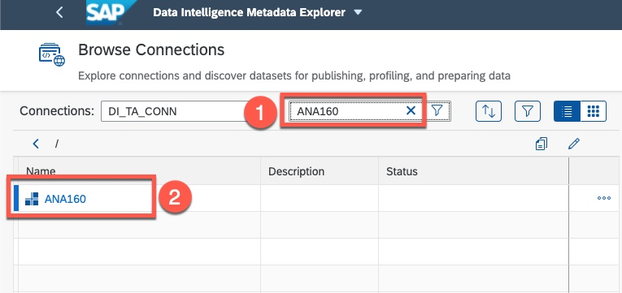
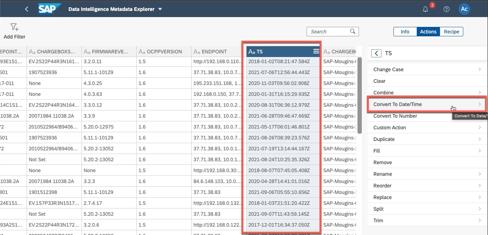
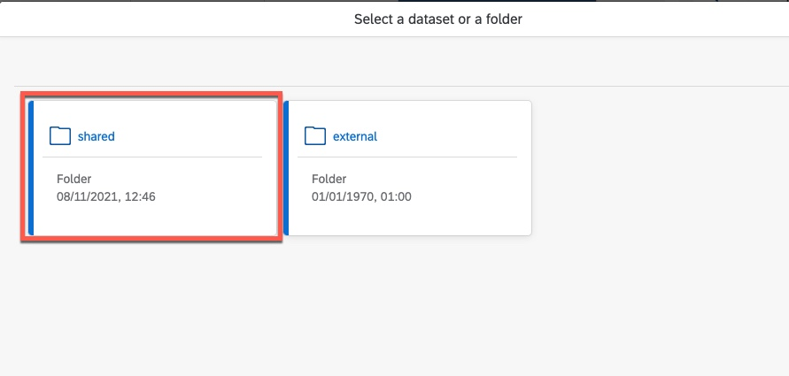
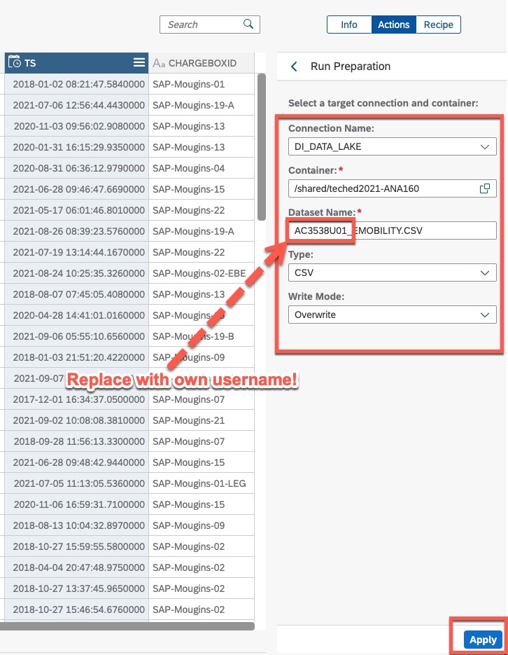

# Exercise 1 - Self-Service Data Preparation

 

<B>SAP Data intelligence Cloud</b>

<b>Self-Service Data Preparation</b>

- - - -

## Exercise 1.1 - Introduction
Welcome to a Technical workshop on SAP Data Intelligence Cloud. This hands-on workshop focusses on the Self-Service Data Preparation capabilities provided by SAP Data Intelligence.

## Business Scenario
In this exercise, we are going to solve a real business challenge by transforming and publishing a dataset using the Self-Service Data Preparation feature for SAP Data Intelligence. 

Business users and data scientists can access, transform, and enrich datasets using a spreadsheet-like user interface in Metadata Explorer.

Use data preparation to find data qualsity issues, correct and standardize data, and then output the data for analysis. This process improves efficiency and gains better business insights.

Use the Data Preparation user interface in Metadata Explorer to view a set of data and create a recipe of actions to shape the data. The system puts these actions into a pipeline, also known as a graph. After processing the preparation, the transformed data is output into a target data set that other downstream applications can use. The Data Preparation user interface creates the graph for you so you do not have to find and configure the operators in the Modeler to create a graph.

At the conclusion of this exercise, you will be able to:
	
* Profile data from different sources
* Collect additional metadata
* Perform data transformation
* Publish transformed data
* Share data with downstream systems (Data Lake)

SAP Data Intelligence Metadata Explorer helps in managing data across systems. The Metadata Explorer helps in making informed decisions about different organizational datasets by profiling and publishing metadata. Users can preview data in the datasets and profile data to view information about the contents of different datasets.
We will use metadata management to profile our customer and business partner data sets from different sources and determine the quality of each dataset. We will also collect additional metadata like the minimum, maximum, averages, completeness, validity of data values. This information will help us determine which datasets need cleansing, masking, or additional operations when we model the data in Modeler application.

**Let's get started!**

Your Instructor will provide you the SAP Data Intelligence Cloud URL and a Username/Password to login.   
   - Log on using the following information:
   

Click on the Metadata Explorer Tile :

## Exercise 1.2 - Metadata Explorer

In the SAP Data Intelligence Launchpad, click on Metadata Explorer tile. This will open the Metadata Explorer.

The Metadata Explorer Home page contains options help you search for data on a connection, create data preparations, profile or publish a dataset, create rules or a business glossary, monitor tasks, or modify your user preferences,

## Exercise 1.3 - Browse Connections

Open Browse Connections by choosing Catalog -> Browse Connections. The connections that we created in the Connection Management application are listed, select the ``list View`` option for more connection details.

You may filter the connections to view your connection easily. Type ``DI_TA_CONN`` in the "Filter Connection names" and filter the result set.

Open the SAP Hana Cloud connection by clicking on the ``DI_TA_CONN`` link. After the ``DI_TA_CONN`` connection is selected, filter and select **AC3538U01** schema where our data table is stored. **EMOBILITY_BOOT_NOTIFICATIONS**. 

## Exercise 1.4 - Profile Data

In our system the **EMOBILITY_BOOT_NOTIFICATIONS** table is already profiled. Just for your information, additional sources can be profiled in the "Metadata Explorer" with the option "Start Profiling".

## Exercise 1.5 - View Fact Sheet

For any profiled dataset you can view the Factsheet. Select "view factsheet" icon

The profiling result shows several metadata facts about the dataset. Notice the total rows in the table, show statistics on each column in the table. The statistics include minimum, maximum, average length, % NULLs and blanks as well as distinct values and uniqueness by column.

Scroll Down:

Click on Columns:

You can click on a column to show statistics for the selected column type.

Scroll down on the next screen: 

You may preview the data by clicking the data preview tab

## Exercise 1.6 - Prepare Dataset

Next, we will **prepare** the dataset to standardize the content. 

Click on **Prepare data** to start data preparation

Notice that the ``TS`` column is native type of ``NVARCHAR`` instead of ``TIMESTAMP``. We must convert these values to ``TIMESTAMP``.

First we need remove and replace the placeholder letter ``T`` with a single ``SPACE`` and placeholder ``Z`` at the end of the string with nothing.

Select ``Actions`` and ``Modify "TS"``.

Replace ``T`` with a single ``SPACE`` and click ``Apply``.

Note that the data was updated and the the placeholder character ``T`` was replaced by a single space!

Let's remove placeholder character ``Z`` by using the ``Replace`` action as we have done in the previous step for letter ``T``.

Leave ``Replace by:`` blank and ``Apply`` the changes.

Verify that both special placeholder characters are replaced and removed.

Select the ``TS`` column and from the Actions available on the right, select action ``Convert To Date/Time``. Select ``yyyy-MM-dd HH:mm:ss.SSS`` format from the choices and click apply.

Notice that the values in the ``TS`` column have been converted to ``TIMESTAMP``.

There are a host of preparation options available. You may need to use other options to implement additional preparations. In this exercise, we are showing only 1 transformation.

Let's run the preparation and save the transformed dataset to the data lake ``DI_DATA_LAKE`` by selecting the target connection as the ``Connection Name``.

Click on ``Container`` to browse and select for the ``teched2021-ANA160`` folder where the data file will stored.

select ``teched2021-ANA160``

Specify the ``Dataset Name``, replace ``AC3538U01`` with the username that was supplied to you. We will save the data in ``CSV`` format.

**Please note: We have created the data preparation but we did not run it because the AC3538U01.EMOBILITY_BOOT_NOTIFICATIONS table is a shared table that is utilised by all workshop attendees.**

## Exercise 1.7 - Publish Dataset

So far, we have profiled and prepared our dataset and changed the ``TS`` column to the required data type of ``TIMESTAMP``. Now, **navigate back** to the Browse Connection screen.

We will now publish the dataset that we transformed and saved to the ``DI_DATA_LAKE`` target, so it becomes accessible to other users.

Select New Publication from transformed dataset in the Data Lake.

This will open the Publication section on the right.

Fill in the relevant fields and click on the Publish button.
**Use below name:** 
* Emobility Notifications EMOB_`<workshop ID>U<group number>`
* e.g. **EMOB_AC3538U01**

**It takes between 2 - 5 minutes to Publish**

After publishing the dataset, refresh the "Browse Connections" section to see the dataset has been published in the ``DI_DATA_LAKE`` ``/shared/teched2021-ANA160`` target location.

The data transformation is now ready for integration. We will also profile the dataset.

**It takes between 2 - 5 minutes to Profile**
**Use the Refresh Button to update the Page**

We finished profiling and publishing our datasets. Next, we will define the business glossary and rules. The quality of these sources can be automatically tracked with Rules. We will cover this topic in the next section.

[Exercise 4. Business Glossary](../4_ExerciseFour/README.md) 

- - - -
