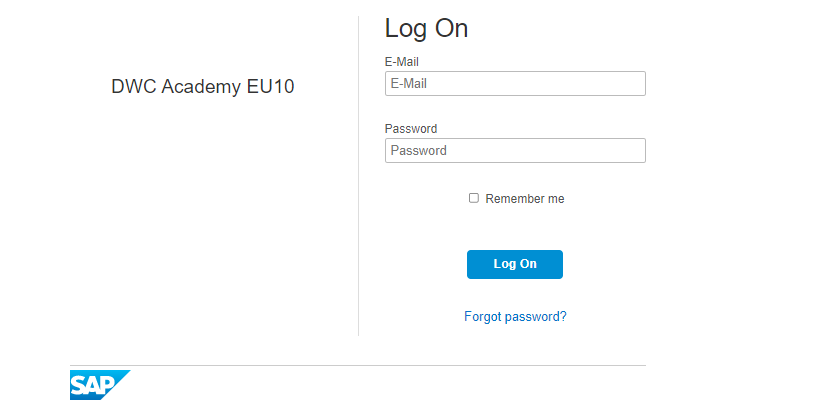
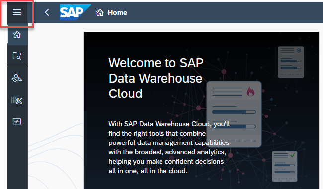
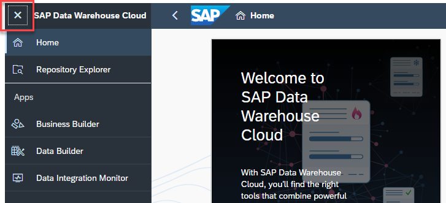
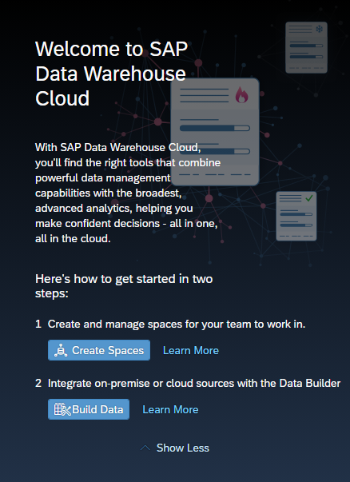

# **Exercise 1: Introduction and Prerequisites **

 

 

 

## Introduction

**Workshop Overview**

 During the course of the exercises you will learn:

- how to create new *Graphical Views*
- introduce *calculations and projections* in the view
- create a view to hold spatial reference data and associate it with the master view
- expose the view to be consumed by *SAP Analytics Cloud Story*

 

 

## Prerequisites

1. Log On information and credentials should have been assigned to you. If not, please contact the workshop coordinator.

2. Each user will have access to their own space with predefined local connections and generated Time Data.

   

 

 

## Log On to SAP Data Warehouse Cloud

1. Please begin by opening a Chrome browser and enter the SAP Data Warehouse Cloud URL provided from your Workshop organizers, via your registration confirmation e-mail.

   

2. Login with your user credentials. 

   

    

3. Expand the **Navigation Menu** in the top left corner to see the full list of features.

   

   

4. Collapse to hide the detail again.

   

   

5. In the middle of the screen, you’ll find some short cuts to the **Space Management**, **Data Builder**, and **Story Builder**, as well as an RSS feed of trending topics on SAP Data Warehouse Cloud. 

   

 
