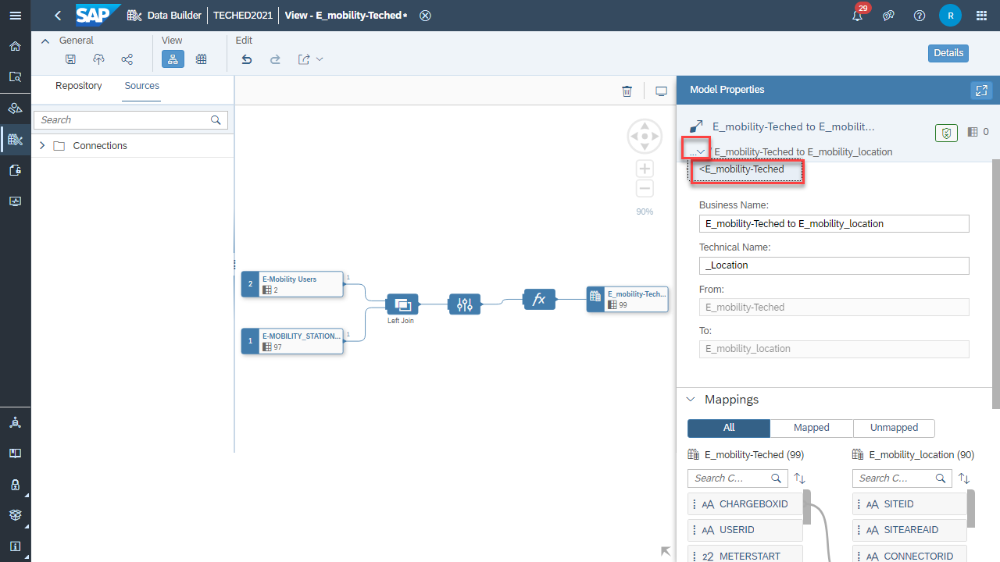

# Exercise 6: 6.Spatial Reference

In this exercise we will build a dimension view with 6.Spatial Reference and associate it with E_mobility-Teched view built in exercise 5.

At the conclusion of this exercise your Graphical View will look similar to the image below

{width="4.5in" height="2.531207349081365in"}

1.  Click on Close button to go back to the DataBuilder

{width="4.5in" height="2.531207349081365in"}

1.  Click on the New Graphical View option in the Data Builder.

{width="4.5in" height="2.028588145231846in"}

3.  To import the data from 'Hana Cloud' navigate to the Sources tab and find the TechEd_HC connection under the Connections. Under **TechEd_HC** Connection drill down on **AC3538U01**

4.  Under **AC3538U01** drill down on **Views** and select **EMOBILITY_LIVE_CHARGE_STATUS**(table) Drag and drop the table in to Canvas

> (Connections -\> TechEd_HC -\> AC3538U01-\> Views-\> EMOBILITY_LIVE_CHARGE_STATUS)

{width="4.5in" height="2.5309962817147857in"}

5.  Click on Output View

{width="4.5in" height="1.9791601049868766in"}

6.  Change Semantic Usage from "Relational Dataset" to "Dimension".

{width="4.5in" height="2.5309962817147857in"}

7.  Click on the "EMOBILITY_LIVE_CHARGE_STATUS" view to open the context menu

8.  Click on "Calculated Columns".

{width="4.416666666666667in" height="2.571205161854768in"}

9.  Click on the **+** icon and select Geo-Coordinates Column

{width="4.5in" height="2.5309962817147857in"}

10. Select Latitude as **LAT**

{width="4.5in" height="2.5309962817147857in"}

11. Select Longitude as **LONG**

{width="4.5in" height="2.3908366141732285in"}

12. Click on Output View

13. And change the Business Name as **E_mobility_location**

14. Technical Name as **Location**

{width="4.5in" height="2.5309962817147857in"}

15. Click on Save and then Deploy.

{width="4.5in" height="2.5309962817147857in"}

16. See that Dimension View has been Deployed

{width="2.0in" height="2.8312959317585302in"}

17. Click on Data Preview to see the data.

{width="4.5in" height="2.5309962817147857in"}

18. Click on Close button and Go to DataBuilder

{width="4.5in" height="2.5309962817147857in"}

19. Click on Analytical Dataset **E_mobility-Teched**

{width="4.5in" height="2.5309962817147857in"}

20. Scroll down to add the Associations.

{width="4.5in" height="2.531207349081365in"}

21. Click on the **+** icon to select the Association.

{width="4.5in" height="2.531207349081365in"}

22. Click on Association

{width="4.5in" height="2.531207349081365in"}

23. Search for View (Dimension)

24. **E_mobility_location**

{width="4.5in" height="2.028588145231846in"}

25. Select that View and click on "OK"

{width="4.5in" height="2.028588145231846in"}

26. See the Mappings between both the Views.

{width="4.5in" height="2.531207349081365in"}

27. Click on {width="1.5in" height="0.33135061242344704in"}

{width="4.550694444444445in" height="2.5597222222222222in"}

28. We can check the associations in the **E_mobility-Teched** view

{width="4.5in" height="2.531207349081365in"}

29. Click on Data preview to see the data.

1.  Click on "Deploy" the View **E_mobility-Teched** to update the changes**.**

