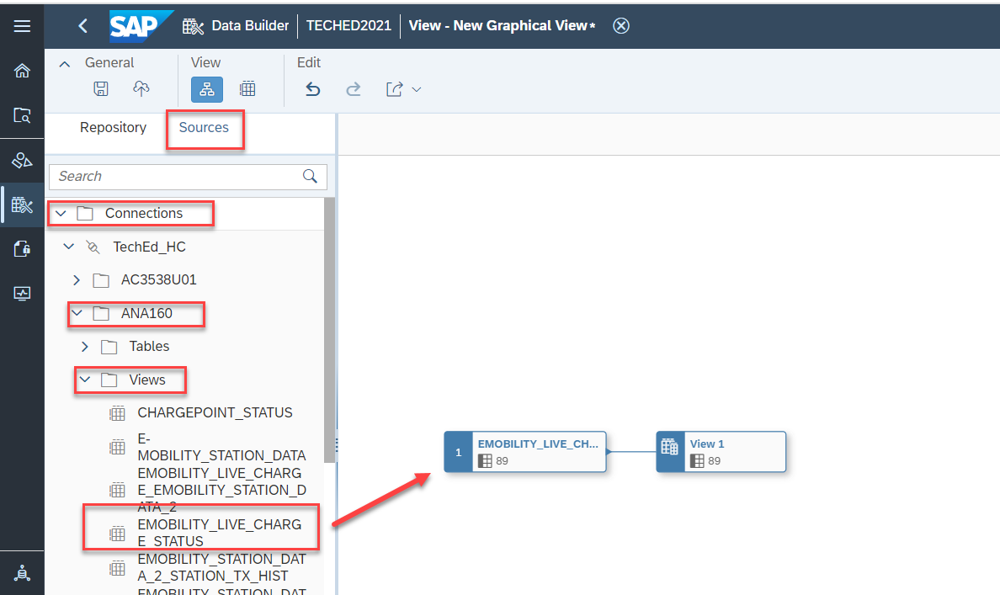

# Exercise 5: Spatial Reference

In this exercise we will build a dimension view with Spatial Reference and associate it with E_mobility-Teched view built in exercise 4.

At the conclusion of this exercise your Graphical View will look similar to the image below

1.  Click on Close button to go back to the DataBuilder

1.  Click on the New Graphical View option in the Data Builder.

1.  To import the data from 'Hana Cloud' navigate to the Sources tab and find the TechEd_HC connection under the Connections. Under **TechEd_HC** Connection drill down on **AC3538U01**

2.  Under **AC3538U01** drill down on **Views** and select **EMOBILITY_LIVE_CHARGE_STATUS**(table) Drag and drop the table in to Canvas

(Drill down flow Connections -\> TechEd_HC -\> AC3538U01-\> Views-\> EMOBILITY_LIVE_CHARGE_STATUS)

1.  Click on Output View

1.  Change Semantic Usage from "Relational Dataset" to "Dimension".

1.  Click on the "EMOBILITY_LIVE_CHARGE_STATUS" view to open the context menu

2.  Click on "Calculated Columns".

1.  Click on the **+** icon and select Geo-Coordinates Column

1.  Select Latitude as **LAT**

1.  Select Longitude as **LONG**

1.  Click on Output View

2.  And change the Business Name as **E_mobility_location**

3.  Technical Name as **Location**

1.  Click on Save, again on Save and then Deploy.

1.  See that Dimension View has been Deployed

1.  From the context menu of E_mobility_location select **Preview** to see the data.

1.  Click on Close button and Go to DataBuilder

1.  Click on the view **E_mobility-Teched**

1.  Scroll down to add the Associations.

1.  Click on the **+** icon to select the Association.

1.  Click on Association

1.  Search for View (Dimension) **E_mobility_location**

1.  Select that View and click on "OK"

1.  See the Mappings between both the Views.

1.  Click on 

1.  We can see the associations in the **E_mobility-Teched** view

1.  From the context menu of  **E_mobility-Teched** select **Preview data** to see the data.

1.  Click on **Deploy** to update the changes**.**

