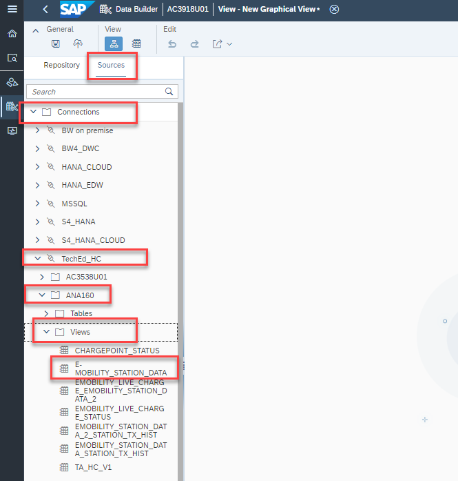

### Exercise 3: Create Graphical View 

We will create our model in an intuitive graphical interface and at the conclusion of this exercise your Graphical View will look similar to the image below

{width="4.5in" height="2.025880358705162in"}

We will continue to enhance the view as we progress through the exercises.

## Data Builder

1.  To expand the navigation menu click on {width="0.375in" height="0.20833333333333334in"} (Click on the lines in the top right corner, you'll see the full list of features)

{width="4.5in" height="2.025880358705162in"}

{width="4.5in" height="2.028588145231846in"}

2.  To start building Data Models click on "Data Builder".

3.  Now select the space in which you are going to work. In our demo click on the Space **TECHED2021**

{width="4.5in" height="2.028588145231846in"}

{width="4.5in" height="2.028588145231846in"}

4.  You can now create a graphical view using the data source from the connection already created. Click on the New Graphical View option in the Data Builder.

{width="4.5in" height="2.3908366141732285in"}

5.  To import the data from "Hana Cloud" navigate to the Sources tab and find the **TechEd_HC** connection under Connections. Drill down **TechEd_HC** Connection, drill down on **AC3538U01**
6.  Drill down **Views**, select **EMOBILITY_STATION_DATA**(table) 
7.  Drag and drop the table (**EMOBILITY_STATION_DATA)**on to the canvas.
8.  (Drill down flow :**Connections -\> TechEd_HC -\> AC3538U01-\> Views-\> EMOBILITY_STATION_DATA**)

{width="4.5in" height="2.0075995188101485in"}

{width="4.5in" height="2.021139545056868in"}

10. To import the data from S/4HANA navigate to the Sources tab and find the **teched_HE4** connection under Connections. Drill down **teched_HE4** Connection, drill down **ABAP Tables by table name**, drill down on "**Z**", drill down on "**ZE**" and choose **ZEMOBILITYUSERS**
11. Drilldown flow :  (**Connections** -\> **teched_HE4** -\> **ABAP Tables by table name** -\> **Z** -\>**ZE** -\> **ZEMOBILITYUSERS**)
12. **Note**: "teched_HE4" which is connecting to S/4Hana system

{width="4.5in" height="2.5309962817147857in"}

13. Drag and drop the table(ZEMOBILITYUSERS) right on top of the "EMOBILITY_STATION_DATA" table and click on JOIN in the pop-up.

{width="4.5in" height="2.5309962817147857in"}
