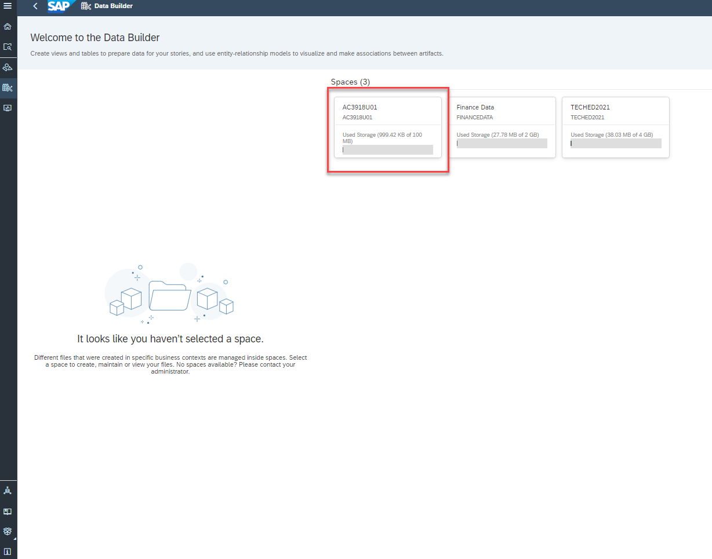

### Exercise 2.2 - Create Graphical View 

We will create our model in an intuitive graphical interface and at the conclusion of this exercise your Graphical View will look similar to the image below

We will continue to enhance the view as we progress through the exercises.

## Data Builder

To expand the navigation menu click on  (Click on the lines in the top left corner, you'll see the full list of features)

To start building Data Models click on "Data Builder".

Now select the space in which you are going to work. In our demo click on the Space **'AC****U**'**. The space name corresponds to your allocated user id

You can now create a graphical view using the data source from the connection already created. Click on the New Graphical View option in the Data Builder.

To import the data from "HANA Cloud" navigate to the Sources tab and find the **TechEd_HC** connection under Connections. Drill down **TechEd_HC** Connection, drill down on **ANA160**
Drill down **Views**, select **EMOBILITY_STATION_DATA**(table).
Drag and drop the table (**EMOBILITY_STATION_DATA)**on to the canvas.
  
  (Drill down flow :**Connections -\> TechEd_HC -\> ANA160-\> Views-\> EMOBILITY_STATION_DATA**).

Click **Import and Deploy**

We have user data present in S/4HANA system.

To import the data from S/4HANA navigate to the Sources tab, close the drill down for TechED_HC. Open **Teched_HE4** connection under Connections. Drill down **teched_HE4** Connection, drill down **ABAP Tables by table name**, drill down on "**Z**", drill down on "**ZE**" and choose **ZEMOBILITYUSERS**

Drilldown flow :  (**Connections** -\> **teched_HE4** -\> **ABAP Tables by table name** -\> **Z** -\>**ZE** -\> **ZEMOBILITYUSERS**)

**Note**: "teched_HE4" which is connecting to S/4HANA system .

Drag and drop the table(ZEMOBILITYUSERS) right on top of the "EMOBILITY_STATION_DATA" table and click on JOIN in the pop-up.
Note: This pop-up might not appear, depending on the area where the table was dragged and dropped.

Click on **Import and Deploy**

[Exercise 3. Configuring Joins](../ex2/join.md)
