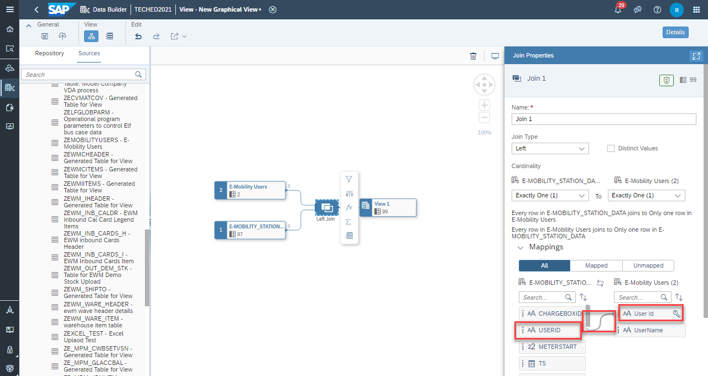
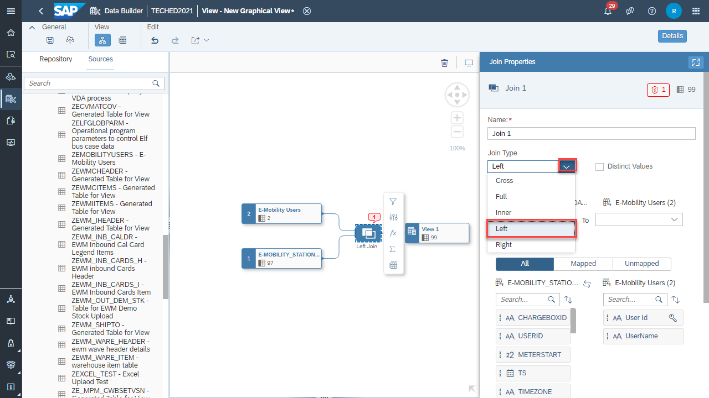
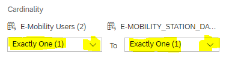
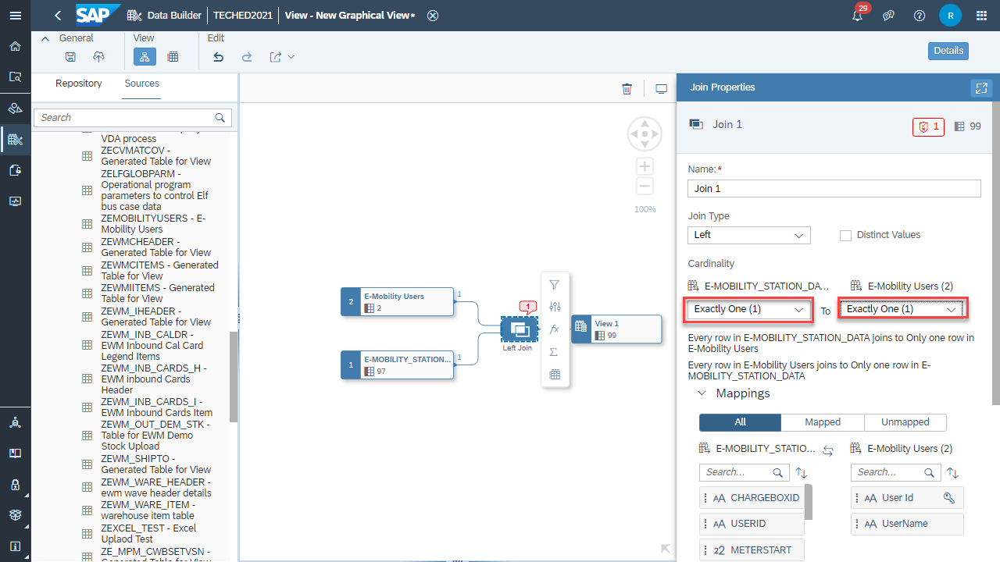

# Exercise 3: Joins

In this exercise we will configure the join E-MOBILITY_STATION table with E-MOBILITY_USERS table.

At the conclusion of this exercise your Graphical View will look similar to the image below

## **Configuring Joins**

1.  Click on the Inner Join box in the canvas, you'll see the JOIN PROPERTIES window on the right-hand side.
2.  Join Type - select **Left**.

> 

3.  Cardinality need to maintained for both tables. Click on  and select Exactly One(1) for both tables

> 
>
> 

4.  Join both the tables by using key record **User Id**

5.  Drag and drop **USERID from E-Mobility Station Data table** on to **User Id present on E-Mobility users table**.

> 
