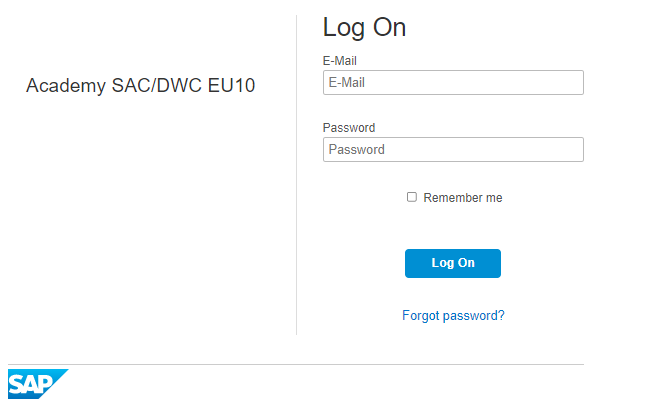

# Exercise 3 - Building dashboards with SAP Analytics Cloud

# Introduction

SAP Analytics Cloud (SAC) is a new generation of Software-as-a-Service (SaaS) that is built on the SAP HANA Cloud Platform which provides business intelligence, planning, and predictive capabilities for all users in one solution. In the boardroom, at the office, or in front of a customer, you can discover, analyze, plan, predict, and collab­orate in one integrated experience designed expressly for the cloud. Access all data and embed analytics directly into business processes to turn instant insight into quick action.

In this hands-on exercise, we will learn 

- How to build bar charts, numeric pointers and sort data for analysis.
- Build geo maps and charts to get insights based on charge box points.

## BEFORE YOU START

SAP Analytics Cloud requires Google Chrome for designing its Stories. 

Access the SAP Analytics cloud system via the URL provided.

# Log in

Launch SAP Analytics Cloud tenant in Chrome

You will receive the login URL along with your assigned username and password ahead of time. Please use the User ID provided to Login.

><!--- {width="4.875890201224847in" height="3.057638888888889in"} -->

SAP Analytics Cloud will prompt you with tooltips to help guide you through the application. You may find it distracting.

If this pops up when you logon you can turn these off by doing the following:

**Click the question mark** on the top right of your window

**Click the toggle off** for 'Guided Page Tips'

><!--- {width="4.758745625546807in" height="1.408455818022747in"} -->

"Navigation Bar" on the left side. You can always expand or hide the side navigation if needed by clicking on the icon. For the next step you need to expand it.

> **"Expand"** Navigation Bar/

><!--- {width="3.6872003499562553in" height="1.153426290463692in"} -->
>
> **"Hide"** Navigation Bar
>
><!--- {width="3.6008694225721785in" height="0.9059000437445319in"} -->

[Exercise 2. Building Visualisations](../ex3/2.Building_visualisations.md) 
