### Exercise 2: Building Visualizations

In this exercise we will build charts, numeric pointers and input control filters to analyze

**Top 10- Consumers(kWh)**
**Top 10- Consumers Inactivity Time(Hours)**
**Bottom 10- Consumers Effective Charging**
**Consumption (kWh) / Cost (€) per Charging Station**
**Errors per Charging Station**
**Total Consumption(kWh) / Total Cost(€)**
**Charging Sessions/Charging Duration**

At the conclusion of this exercise your story will look similar to the image below

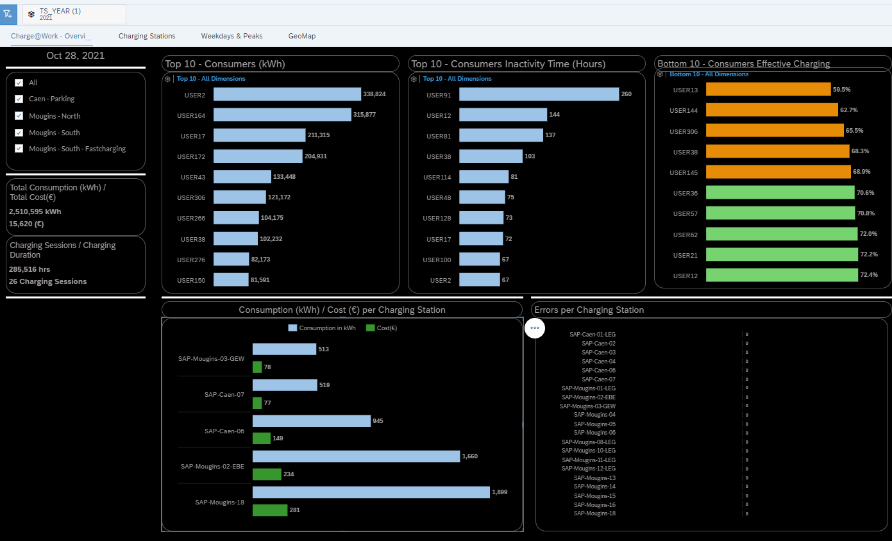{width="6.268055555555556in" height="3.734027777777778in"}

### Building Visualizations:

1.  Navigate to the folder and click on top left hand menu...

> 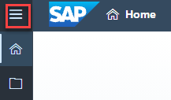{width="1.1984372265966754in" height="0.7013888888888888in"}

2.  Select Files and then **Public** folder

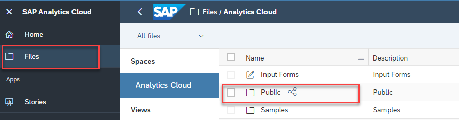{width="5.132003499562555in" height="1.3472222222222223in"}

3.  Search for folder **TechEd2021**

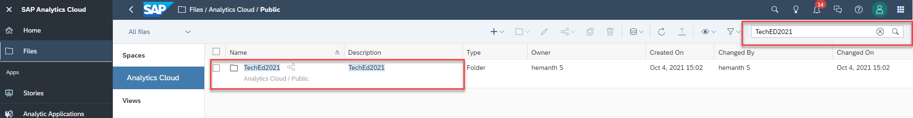{width="7.375926290463692in" height="1.2631944444444445in"}

4.  Select story **E-mobility**

5.  Click Copy

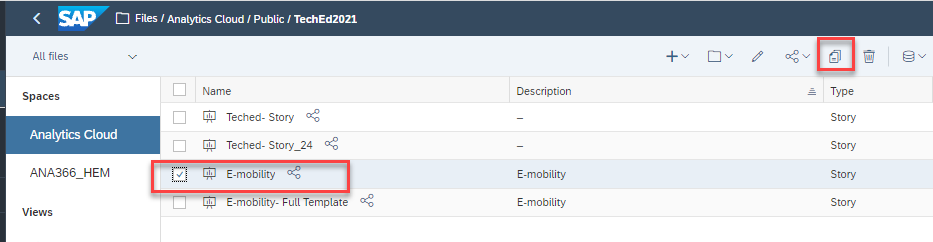{width="6.268055555555556in" height="1.6256944444444446in"}

6.  Select Folder : **Analytics Cloud** and Name it as **E-mobility-XXXXXX**

7.  (replace XXXXXX with your given login ID)

8.  click on **OK**

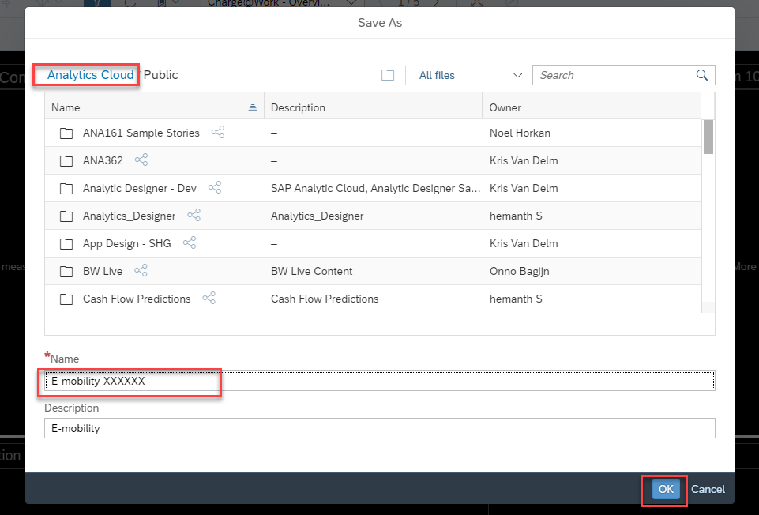{width="6.6739545056867895in" height="4.528010717410324in"}

9.  Now, Go to Files, Click on Analytics Cloud-/> you will see the story saved.

10. Click on the **E-mobility-XXXXXX** story to launch.

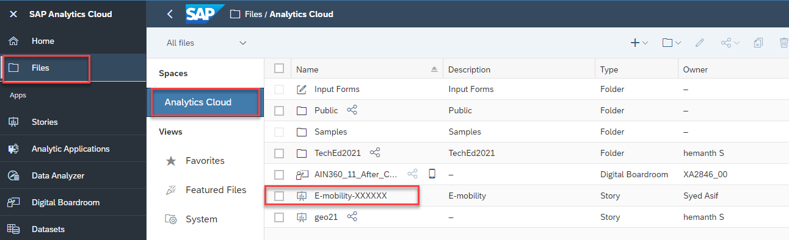{width="6.586111111111111in" height="2.0083333333333333in"}

11. You see blank KPI's without data.

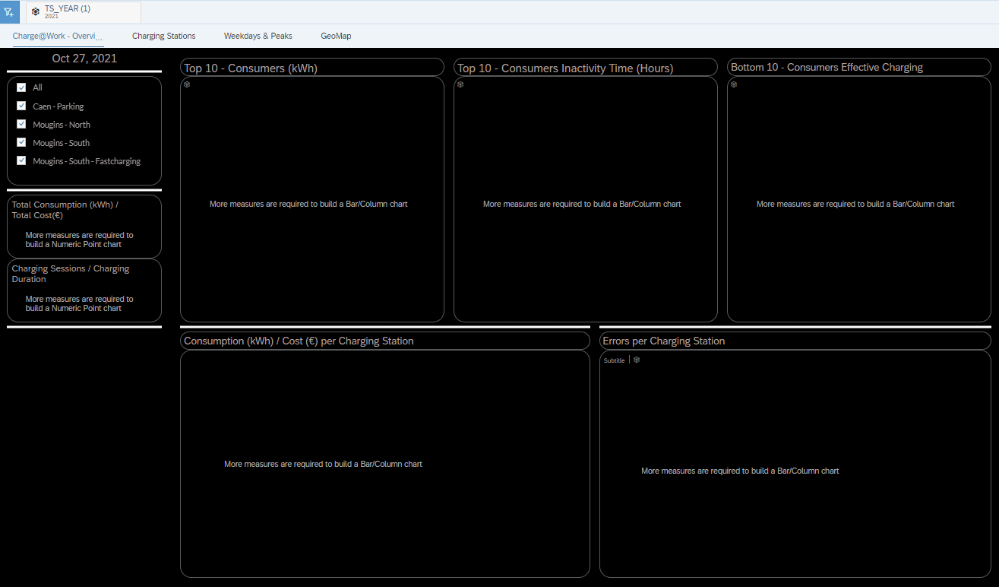{width="5.1409722222222225in" height="2.8541666666666665in"}

12. Let's start building the first KPI:

**Top 10 - Consumers (kWh)**

13. Click on the Top 10- Consumers (kWh) Tile and then the click Edit -/> Designer tab, you see the Builder properties window

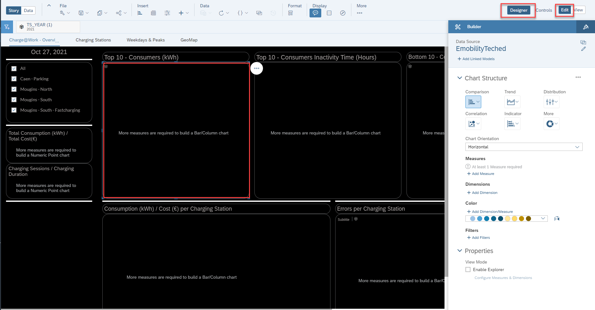{width="4.895833333333333in" height="2.540751312335958in"}

14. Now select Measure: Consumption in kWh

15. Dimension: UserName (Can search using the searchbox)

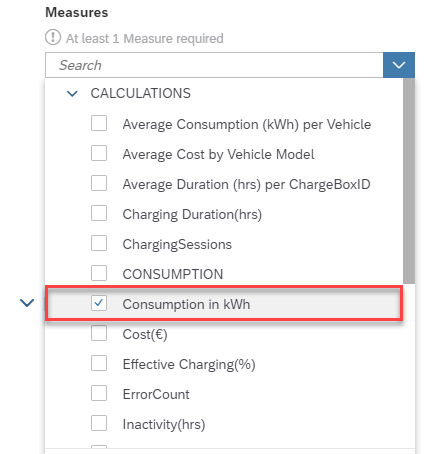{width="3.014044181977253in" height="1.8820406824146982in"}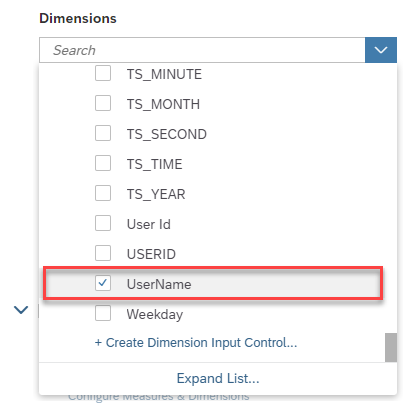{width="2.7223622047244094in" height="3.5349037620297463in"}

16. Select **3 dots** on the chart tile and click on **Rank- Top N options**

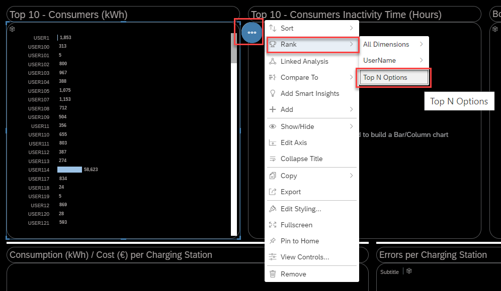{width="5.141666666666667in" height="3.0548611111111112in"}

17. Type **value= 10** and **Apply**

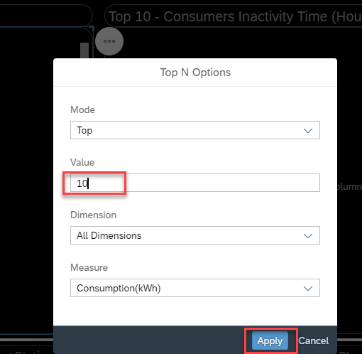{width="3.5418482064741905in" height="3.458511592300962in"}

18. We have built the **Top 10- Consumers by Consumption(kWh)** KPI chart

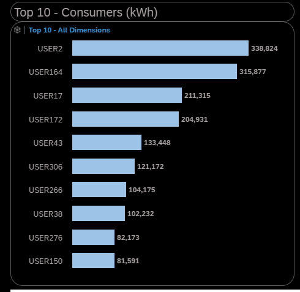{width="3.2848906386701664in" height="3.2501673228346455in"}

**Top 10- Consumers Inactivity Time(Hours)**

19. Let's build the second KPI: Top 10- Consumers Inactivity Time(Hours)

20. Click on the Top 10- Consumers Inactivity Time(Hours) Tile.

     ( Note:  When you click on the Tile, you should see the Designer Tab, if not click on Designer tab to see the Builder properties window )

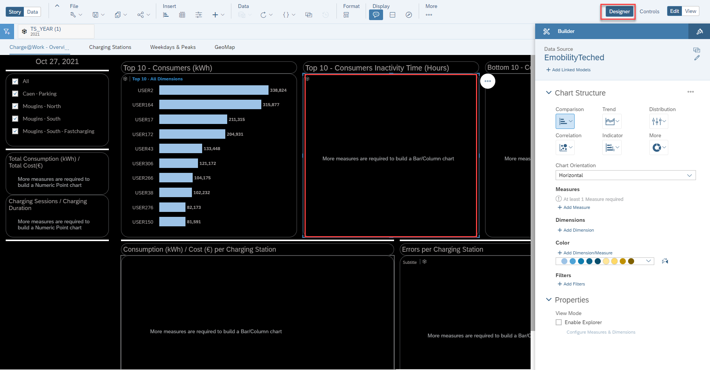{width="5.141666666666667in" height="2.6881944444444446in"}

21. Select Measure: Inactivity(hrs) and

22. Dimension: Username

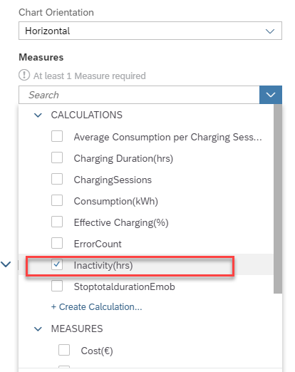{width="2.8751476377952754in" height="3.6251859142607175in"}

{width="2.7223622047244094in" height="3.5349037620297463in"}

23. Select **3 dots** on the chart tile and click on **Rank- Top N options**

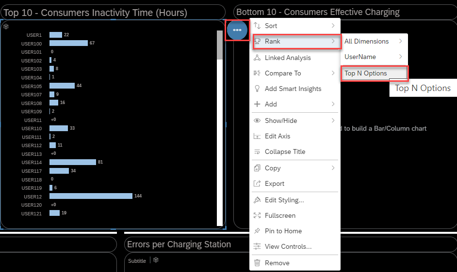{width="6.021142825896763in" height="3.9029779090113736in"}

24. Type **value=** **10** and **Apply**

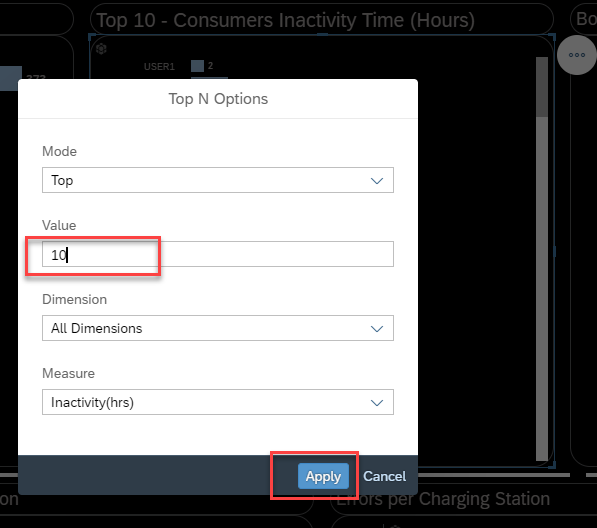{width="4.146046587926509in" height="3.6668547681539807in"}

25. We have built the Top 10- Consumers Inactivity Time(Hours) Chart

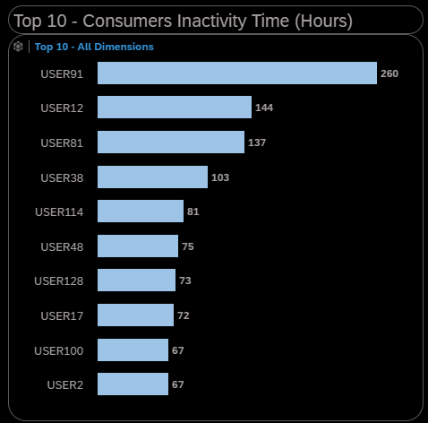{width="3.368228346456693in" height="3.3751738845144357in"}

**Bottom 10- Consumers Effective Charging**

26. Click on the Bottom 10- Consumers Effective Charging Tile and then bring the Designer Tab, you see the Builder properties window

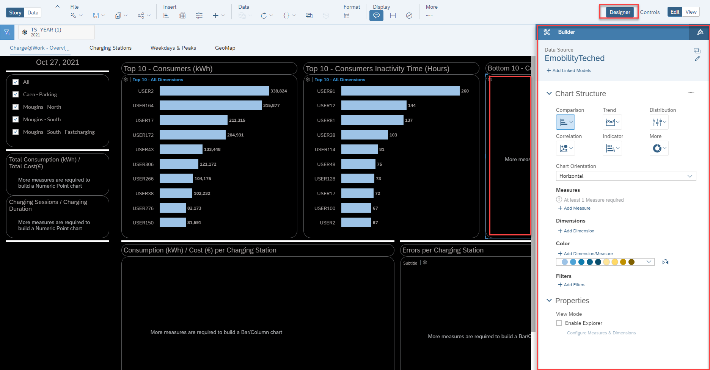{width="5.141666666666667in" height="2.6993055555555556in"}

27. Select Measure: Effective Charging(%) and

28. Dimension: Username

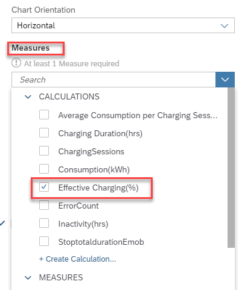{width="2.7501410761154856in" height="3.3404494750656166in"}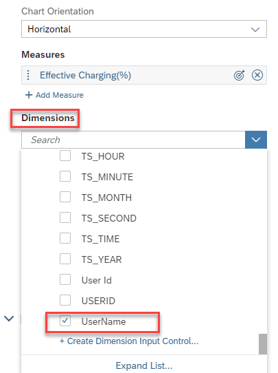{width="2.8126443569553805in" height="3.7640824584426946in"}

29. Select **3 dots** on the chart tile and click on **Rank- Top N options**

    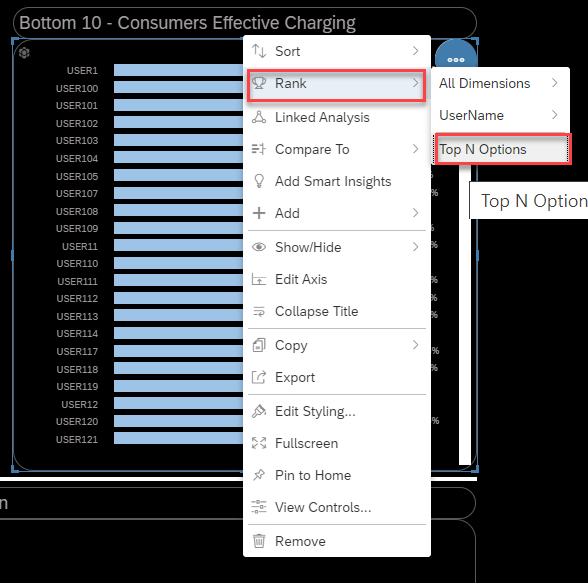{width="4.264107611548557in" height="4.159935476815398in"}

31. Select **Mode= Bottom,**

31. **value= 10** and **Apply**

    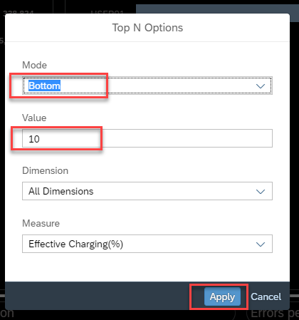{width="3.0626574803149604in" height="3.027933070866142in"}

    

32. Now let's add Threshold to see the effective (%)

33. Click on the 3 dots, click Add and select Threshold

    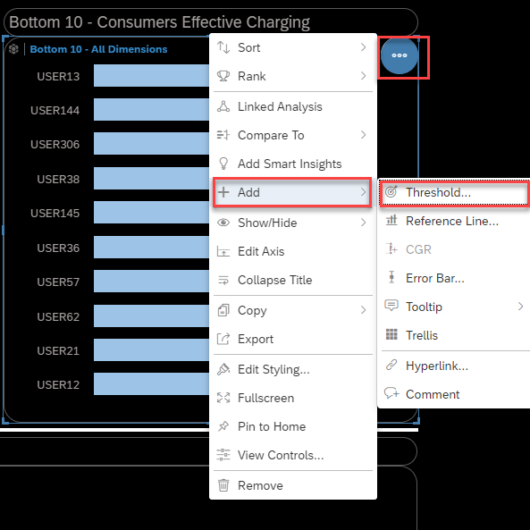{width="3.0626574803149604in" height="3.027933070866142in"}

    

34. On the Threshold properties window, Select Measure Effective Charging(%) from the drop down list 

    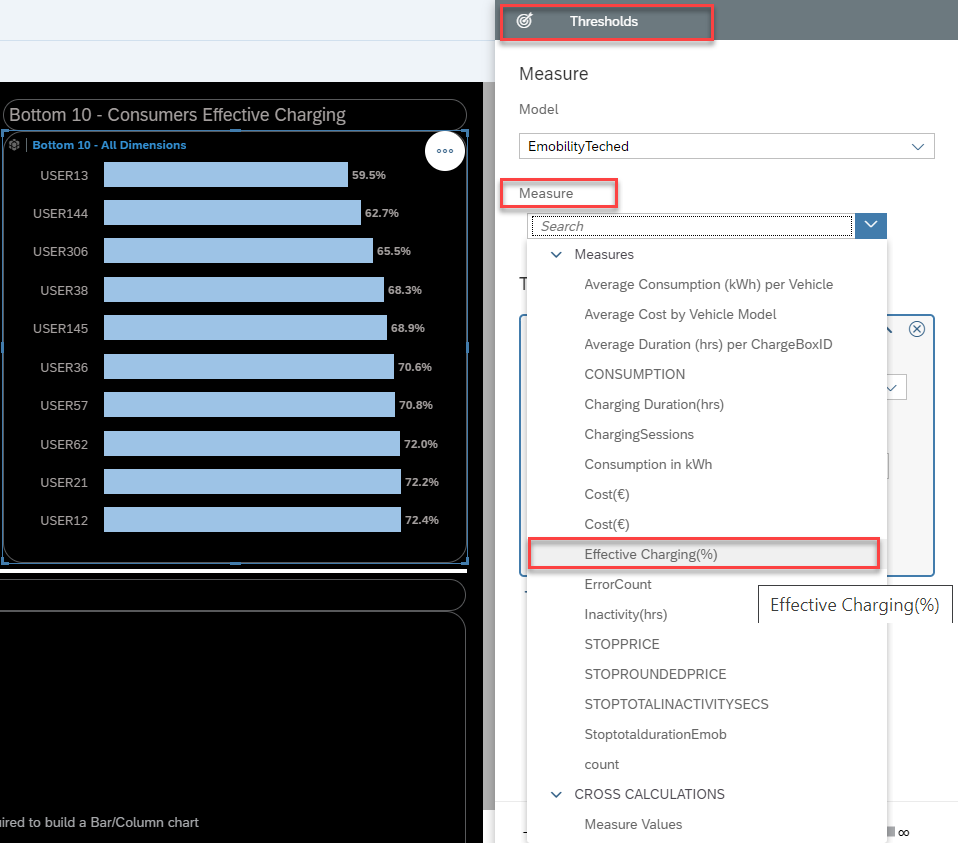{width="3.0626574803149604in" height="3.027933070866142in"}

    

35. On the Thresholds, add range by clicking + Add range option to add different ranges for

    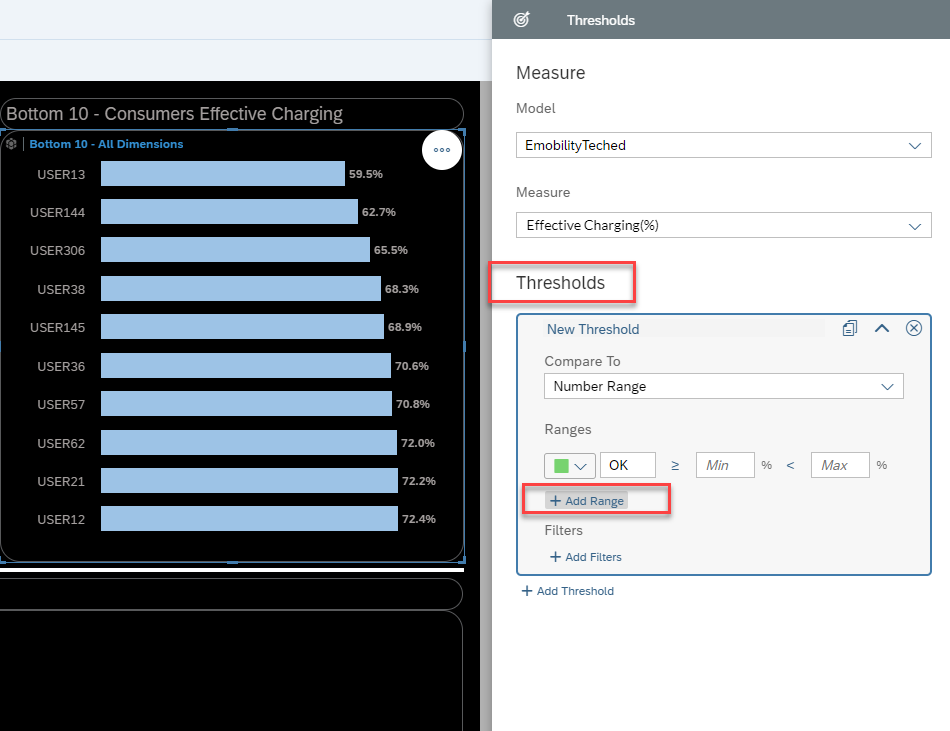{width="3.0626574803149604in" height="3.027933070866142in"}

36. Now give the range as below and click on Apply:

    Red(Critical)= 0 to 50

    Orange(Warning)= 50 to 70

    Green(Ok)= 70 to 100

    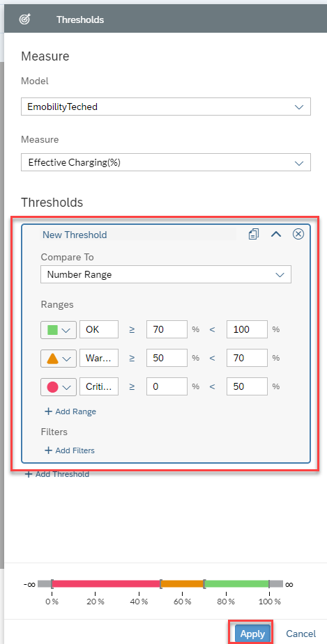{width="2.5208333333333335in" height="8.113501749781276in"}

    

37. Now, click on measure Effective Charging(%) threshold icon, select Show Threshold and select **Story Defined** option

    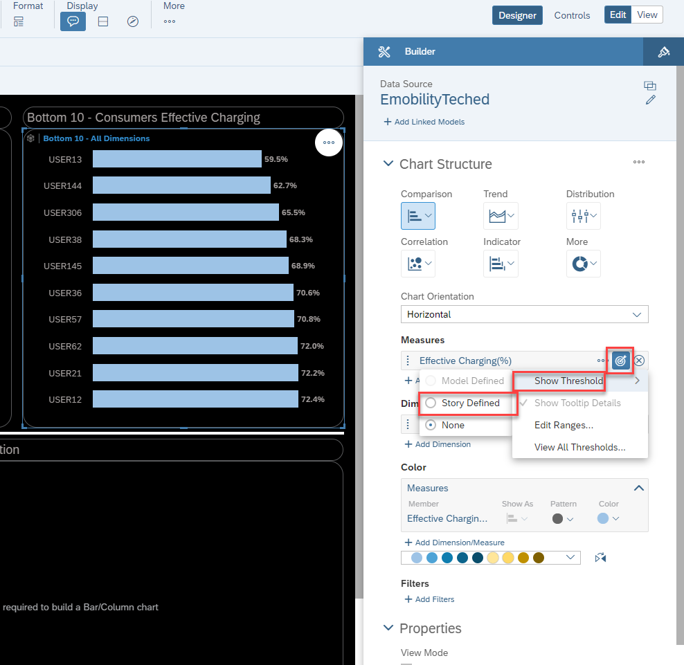{width="4.264107611548557in" height="4.159935476815398in"}

38. You will notice the Threshold values in different colors as defined.

    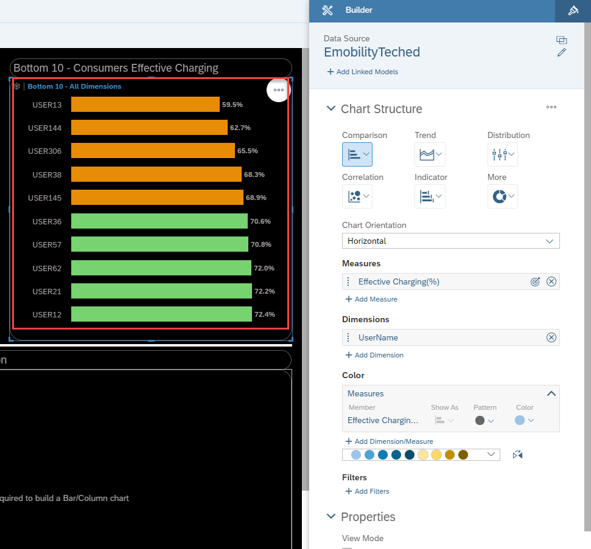{width="4.264107611548557in" height="4.159935476815398in"}

39. You are ready with the Bottom 10- Consumers Effective Charging chart

    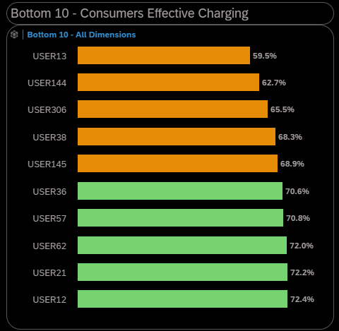{width="4.264107611548557in" height="4.159935476815398in"}

**Consumption (kWh) / Cost (€) per Charging Station**

40. Click on Consumption (kWh)/Cost(€) per Charging Station tile and then the Designer tab, you see the Builder properties window

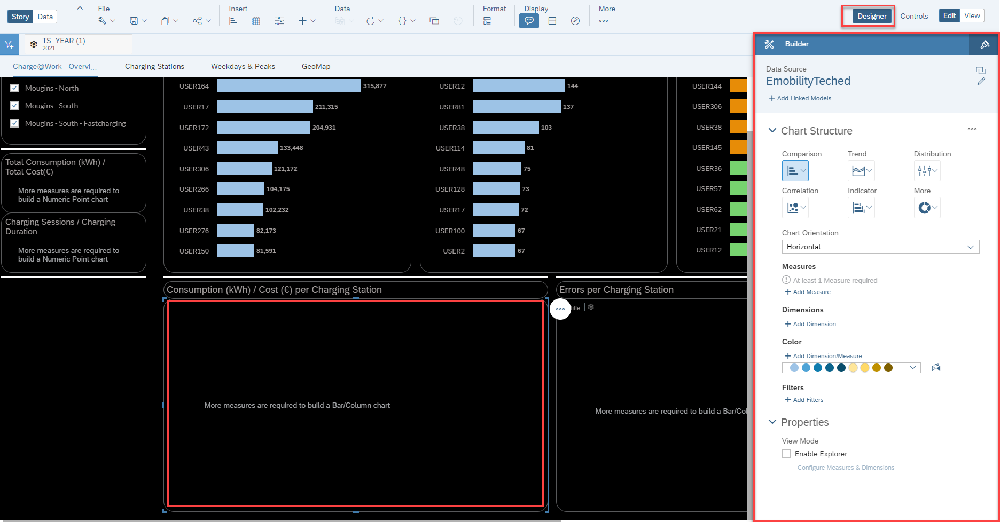{width="5.447154418197726in" height="3.251388888888889in"}

41. Select Measure as : Consumption in kWh and Cost(€)

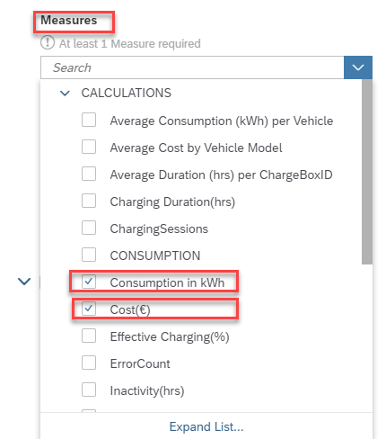{width="2.9376509186351707in" height="3.7224136045494314in"}

42. Dimension as: ChargboxID

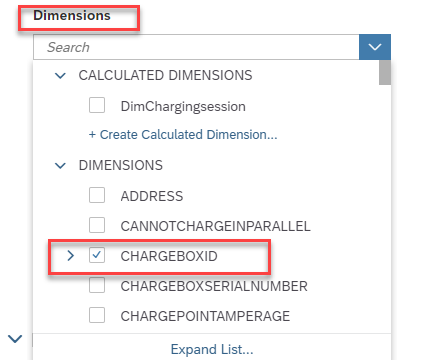{width="2.7084722222222224in" height="3.694634733158355in"}

43. Select **3 dots** on the chart tile and click on **Sort- Consumption(kWh)- Highest to Lowest**

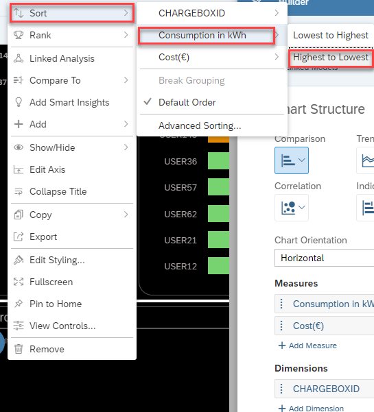{width="5.034981408573929in" height="4.11132217847769in"}

44. We have built the Consumption (kWh) / Cost (€) per Charging Station chart

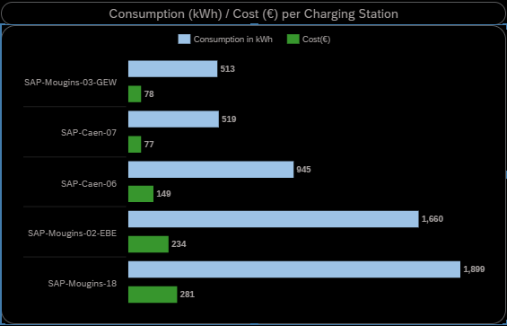{width="3.9724267279090113in" height="2.6320800524934382in"}

**Errors per Charging Station**

45. Click on Errors per Charging Station tile and then the Designer tab, you see Builder properties window

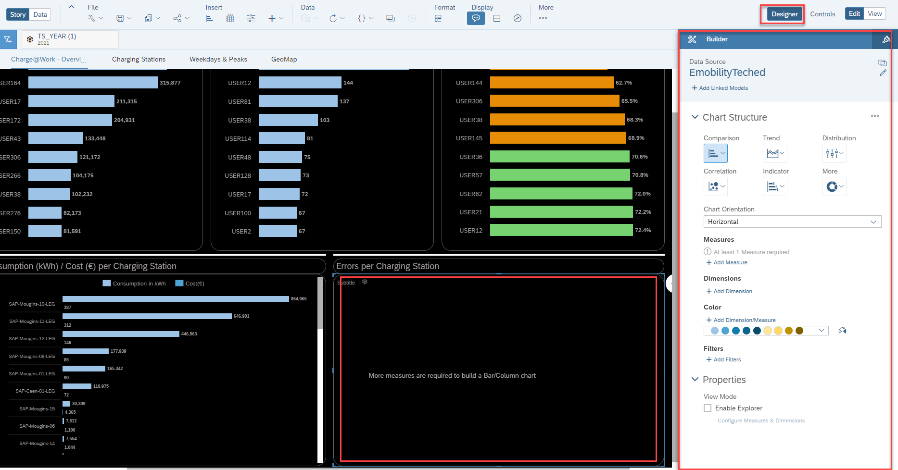{width="6.268055555555556in" height="3.2416666666666667in"}

46. Select Measure: Errorcount and Dimension as ChargeboxID

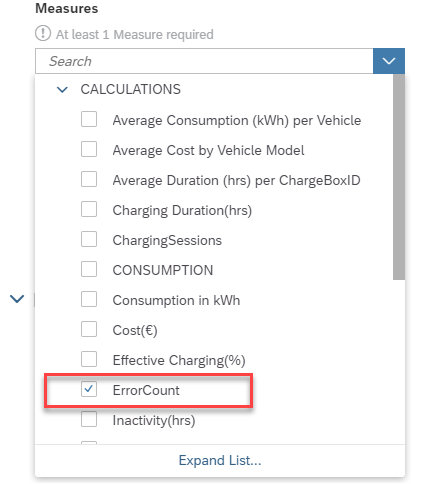{width="2.8543132108486438in" height="3.4862904636920384in"}

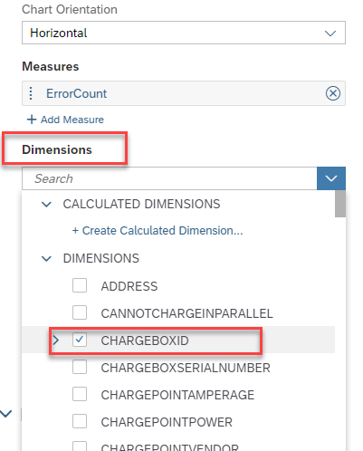{width="2.7848654855643042in" height="3.458511592300962in"}

47. We have built the Errors per Charging Station chart

(Note: All the values are Zero as there are no Errors per Charging Station seen)

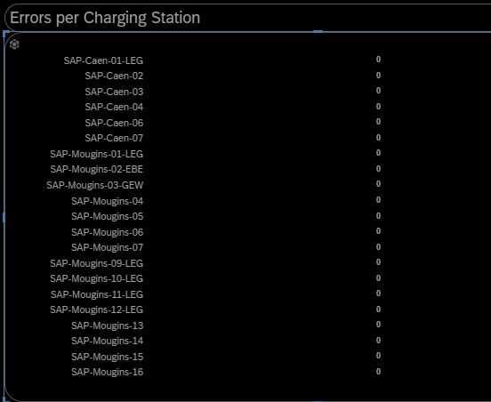{width="3.8333333333333335in" height="3.138888888888889in"}

**Total consumption/Total Cost - Numeric pointer**

48. Click on the numeric point tile and then the Designer tab, you see Builder properties window

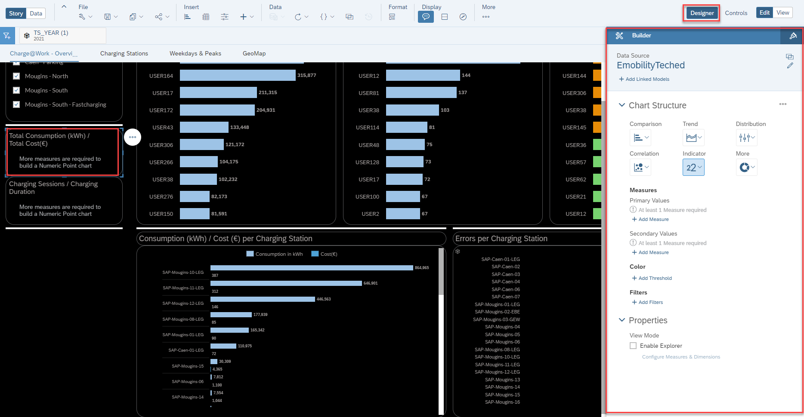{width="3.9652777777777777in" height="2.0050568678915135in"}

49. Add measures **Consumption in kWh** and **Cost(€)**

> 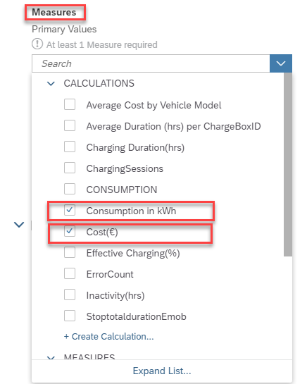{width="2.944595363079615in" height="3.8265857392825895in"}

50. You will see the output as

> 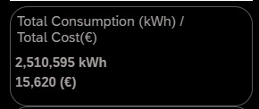{width="1.5070220909886265in" height="0.6667005686789151in"}

**Charging sessions/Charging duration: Numeric pointer**

51. Click on the numeric point tile and then the Designer tab, you see Builder properties window

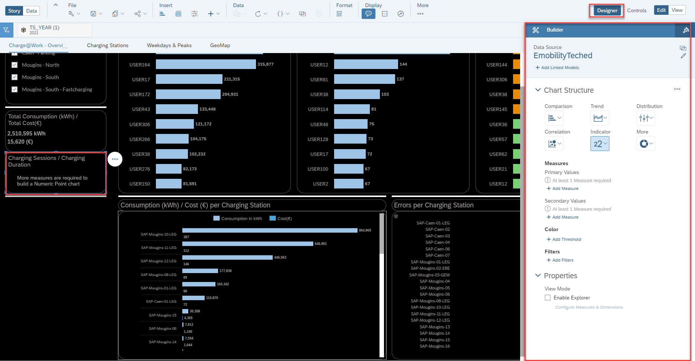{width="3.7777777777777777in" height="2.387173009623797in"}

52. Add measure: **ChargingSessions** and **Charging Duration(hrs)**

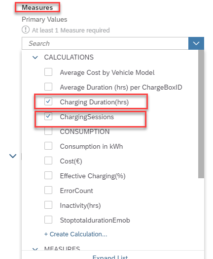{width="2.944595363079615in" height="3.7849168853893262in"}

53. You will see the output as

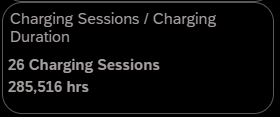{width="1.5000765529308837in" height="0.6736461067366579in"}

**Lets add Linked Analysis feature with the Input control to the story:**

54. Click 3 dots on the Input control tile... then select Linked Analysis

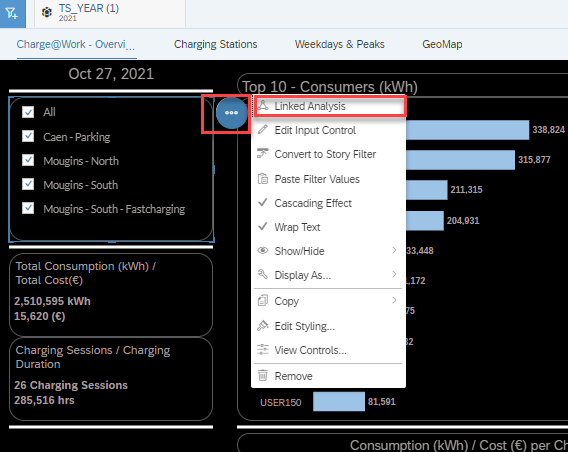{width="3.680744750656168in" height="2.7640310586176726in"}

55. On the Linked Analysis properties window, select "**All Widgets on the Page**" option and Apply

> 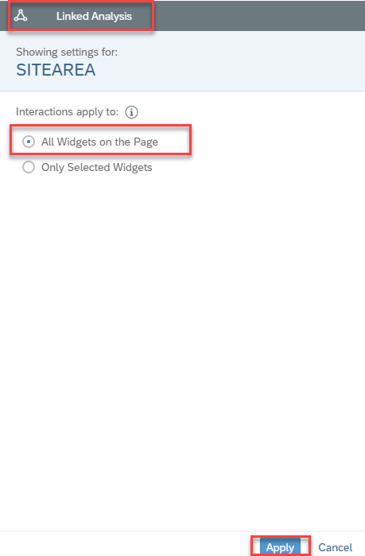{width="2.6945833333333336in" height="0.5347495625546806in"}

56. Now, you can select and deselect the SITEAREA to see the different interactions on the chart/values

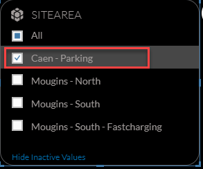{width="2.0348272090988626in" height="1.6945319335083115in"}

57. You have build the final story. 

{width="6.268055555555556in" height="3.734027777777778in"}

58. Click on Save

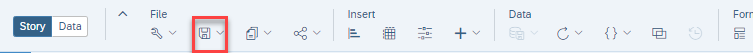{width="5.229435695538058in" height="0.36807414698162727in"}

This completes Exercise 2 Building Visualizations

