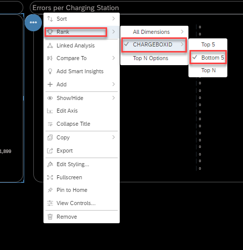

### Exercise 2: Building Visualizations

In this exercise we will build charts, numeric pointers and input control filters to analyze

1. Top 10- Consumers(kWh)
3. Top 10- Consumers Inactivity Time(Hours)
4. Bottom 10- Consumers Effective Charging
5. Consumption (kWh) / Cost (€) per Charging Station
6. Errors per Charging Station
7. Total Consumption(kWh) / Total Cost(€)
8. Charging Sessions/Charging Duration

You will find the definition of each of the above KPI in the respective section. For the rest of the pages, we have included the KPI definitions in the Appendix. 

At the conclusion of this exercise your story will look similar to the image below

<!--- {width="6.268055555555556in" height="3.734027777777778in"} -->

### Building Visualizations:

Expand the Navigation bar (If not already expanded)

> <!--- {width="1.1984372265966754in" height="0.7013888888888888in"} -->

Select Files and then **Public** folder

Search for folder **TechEd2021**

<!--- {width="7.375926290463692in" height="1.2631944444444445in"} -->

Select story **E-mobility**

Click Copy

<!--- {width="6.268055555555556in" height="1.6256944444444446in"} -->

Select Folder : **Analytics Cloud** and Name it as **E-mobility-XXXXXX**   (replace XXXXXX with your given login ID)

click on **OK**

<!--- {width="6.6739545056867895in" height="4.528010717410324in"} -->

Go to Files, click on Analytics Cloud, you will see the story saved.

Click on the **E-mobility-XXXXXX** story to launch.

<!--- {width="6.586111111111111in" height="2.0083333333333333in"} -->

You see blank KPI's without data.

<!--- {width="5.1409722222222225in" height="2.8541666666666665in"} -->

Let's start building the first KPI:

**Top 10 - Consumers (kWh)**

This is to visualise Top 10 employees with the highest consumption in kWh over the selected time period. 

Select the Top 10 – Consumers Tile and then select “Edit” and “Designer” to see the Builder properties window

<!--- {width="4.895833333333333in" height="2.540751312335958in"} -->

Now select +Add Measure: Consumption in kWh

Dimension: UserName (Can search using the searchbox)

Select **3 dots** on the chart tile and click on **Rank- Top N options**

<!--- {width="5.141666666666667in" height="3.0548611111111112in"} -->

Type **value= 10** and **Apply**

<!--- {width="3.5418482064741905in" height="3.458511592300962in"} -->

We have built the **Top 10- Consumers by Consumption(kWh)** KPI chart

<!--- {width="3.2848906386701664in" height="3.2501673228346455in"} -->

**Top 10- Consumers Inactivity Time(Hours)**

This KPI indicates how long the user is still plugged in but no longer charging. A notification can be sent to an user to free up the charging station when charging has been completed. 

Let's build the second KPI: Top 10- Consumers Inactivity Time(Hours)

Click on the Top 10- Consumers Inactivity Time(Hours) Tile.

     ( Note:  When you click on the Tile, you should see the Designer Tab, if not click on Designer tab to see the Builder properties window )

<!--- {width="5.141666666666667in" height="2.6881944444444446in"} -->

Select +Add Measure and select Inactivity(hrs) 

<!--- {width="2.8751476377952754in" height="3.6251859142607175in"} -->

Dimension: Username

<!--- {width="2.7223622047244094in" height="3.5349037620297463in"} -->

Select **3 dots** on the chart tile and click on **Rank- Top N options**

<!--- {width="6.021142825896763in" height="3.9029779090113736in"} -->

Type **value=** **10** and **Apply**

<!--- {width="4.146046587926509in" height="3.6668547681539807in"} -->

We have built the Top 10- Consumers Inactivity Time(Hours) Chart

<!--- {width="3.368228346456693in" height="3.3751738845144357in"} -->

**Bottom 10- Consumers Effective Charging**

Effective Charging is a KPI that indicates the ratio between charging station being utilised and inactive.

Click on the Bottom 10- Consumers Effective Charging tile and then bring the Designer Tab, you see the Builder properties window

<!--- {width="5.141666666666667in" height="2.6993055555555556in"} -->

Select Measure: Effective Charging(%) and

Dimension: Username

<!--- {width="2.7501410761154856in" height="3.3404494750656166in"} --><!--- {width="2.8126443569553805in" height="3.7640824584426946in"} -->

Select **3 dots** on the chart tile and click on **Rank- Top N options**

<!--- {width="4.264107611548557in" height="4.159935476815398in"} -->

Select **Mode= Bottom**

**value= 10** and **Apply**
   
 <!--- {width="3.0626574803149604in" height="3.027933070866142in"} -->

    

Now let's add Threshold to see the effective (%). With Thresholds we can define conditional formatting.

Click on the 3 dots, click Add and select Threshold

<!--- {width="3.0626574803149604in" height="3.027933070866142in"} -->

    

On the Threshold properties window, Select Measure Effective Charging(%) from the drop down list 

<!--- {width="3.0626574803149604in" height="3.027933070866142in"} -->

    

On the Thresholds, add range by clicking + Add range option (click 2 times) to add different ranges for

    <!--- {width="3.0626574803149604in" height="3.027933070866142in"} -->

Now set the range as below and click on Apply:

    Green(Ok)= 70 to 100
    
    Orange(Warning)= 50 to 70

    Red(Critical)= 0 to 50

    
<!--- {width="2.5208333333333335in" height="8.113501749781276in"} -->

    

Now, click on measure Effective Charging(%) threshold icon, select Show Threshold and select **Story Defined** option

<!--- {width="4.264107611548557in" height="4.159935476815398in"} -->

You will notice the Threshold values in different colors as defined.

    <!--- {width="4.264107611548557in" height="4.159935476815398in"} -->

We have built the Bottom 10- Consumers Effective Charging chart

  <!--- {width="4.264107611548557in" height="4.159935476815398in"} -->

**Consumption (kWh) / Cost (€) per Charging Station**

Here we can see the cost and consumption per charging stations. 

Click on Consumption (kWh)/Cost(€) per Charging Station tile and then the Designer tab, you see the Builder properties window

<!--- {width="5.447154418197726in" height="3.251388888888889in"} -->

Select Measure as : Consumption in kWh and Cost(€)

<!--- {width="2.9376509186351707in" height="3.7224136045494314in"} -->

Dimension as: ChargeboxID

<!--- {width="2.7084722222222224in" height="3.694634733158355in"} -->

Select **3 dots** on the chart tile and click on **Rank -> CHARGEBOXID -> Bottom5**

<!--- {width="5.034981408573929in" height="4.11132217847769in"} -->

We have built the Consumption (kWh) / Cost (€) per Charging Station chart

<!--- {width="3.9724267279090113in" height="2.6320800524934382in"} -->

**Errors per Charging Station**

This is an important KPI to monitor if the charging stations are having any issues. If an errors is present, the administrator can restart the charging station and check if the issue resolves. 

Click on Errors per Charging Station tile and then the Designer tab, you see Builder properties window

<!--- {width="6.268055555555556in" height="3.2416666666666667in"} -->

Select Measure: Errorcount and Dimension as ChargeboxID

<!--- {width="2.8543132108486438in" height="3.4862904636920384in"} -->

<!--- {width="2.7848654855643042in" height="3.458511592300962in"} -->

We have built the Errors per Charging Station chart

(Note: All the values are Zero as there are no Errors per Charging Station seen)

<!--- {width="3.8333333333333335in" height="3.138888888888889in"} -->

**Total consumption/Total Cost - Numeric pointer**

Here we can see a numeric values for total Consumption in kWh and Cost in euros over the selected timeframe. This KPI automatically updates when a different timeframe in the filter is selected

Click on the numeric point tile and then the Designer tab, you see Builder properties window

<!--- {width="3.9652777777777777in" height="2.0050568678915135in"} -->

Add measures **Consumption in kWh** and **Cost(€)**

> <!--- {width="2.944595363079615in" height="3.8265857392825895in"} -->

You will see the output as

> <!--- {width="1.5070220909886265in" height="0.6667005686789151in"} -->

**Charging sessions/Charging duration: Numeric pointer**

Here we can see a numeric values for total nr of Charging Sessions and Charging Duraion. This KPI automatically updated when a different timeframe in the filter is selected

Click on the numeric point tile and then the Designer tab, you see Builder properties window

<!--- {width="3.7777777777777777in" height="2.387173009623797in"} -->

Add measure: **ChargingSessions** and **Charging Duration(hrs)**

<!--- {width="2.944595363079615in" height="3.7849168853893262in"} -->

You will see the output as

<!--- {width="1.5000765529308837in" height="0.6736461067366579in"} -->

**Lets add Linked Analysis feature with the Input control to the story:**

Click 3 dots on the Input control tile... then select Linked Analysis. Linked Analysis feature allows us to perform dynamic interaction between widgets.

<!--- {width="3.680744750656168in" height="2.7640310586176726in"} -->

On the Linked Analysis properties window, select "**All Widgets on the Page**" option and Apply

> <!--- {width="2.6945833333333336in" height="0.5347495625546806in"} -->

Now, you can select and deselect the SITEAREA to see the different interactions on the chart/values

<!--- {width="2.0348272090988626in" height="1.6945319335083115in"} -->

You have built the final story. 

<!--- {width="6.268055555555556in" height="3.734027777777778in"} -->

Click on Save

<!--- {width="5.229435695538058in" height="0.36807414698162727in"} -->

This completes Exercise 2 Building Visualizations

[Exercise 3. Geographic Visualisations](../ex3/3.Geographic_visualisations.md) 