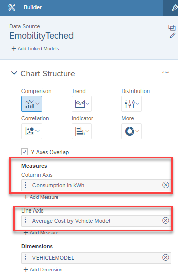
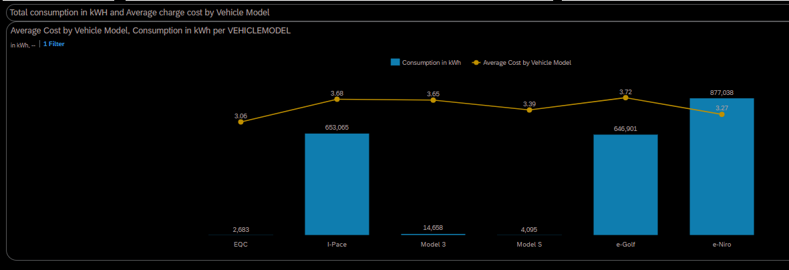

Exercise 3: Geographic Visualisations

In this exercise we will build

- Geo map to present **Charging point Locations** 
- Bar chart to analyse **Charging Duration (hrs) by Charge Point Vendors**
- Chart to get insights on the **Total Cost(€) and Average Cost(€) by Vehicle Model**

You will find the definition of each of the above KPI in the respective section. For the rest of the pages, we have included the KPI definitions in the Appendix.

At the conclusion of this exercise your story will look similar to the image below

<!--- {width="5.65in" height="3.189583333333333in"} -->

**Let's build a Geo Map:**

1.  Select GeoMap on the story

<!--- {width="4.80580271216098in" height="1.0972790901137357in"} -->

2.  Click on **Edit** (if not in Edit mode)

<!--- {width="2.2987292213473314in" height="0.826431539807524in"} -->

3.  Click on Insert Tool Bar and select Geo Map component.

<!--- {width="5.145833333333333in" height="2.4368055555555554in"} -->

4.  Drag Geo Map component to fit the selected area

<!--- {width="6.268055555555556in" height="3.8645833333333335in"} -->

5.  Now click on the Geo Map area and then click Designer to see the Map properties

<!--- {width="5.196850393700787in" height="2.173228346456693in"} -->

6.  Click on Add Layer.

<!--- {width="3.2501673228346455in" height="3.368228346456693in"} -->

7.  Make sure you are pointing to the right Data Source (Emobility Teched)

8.  Select Location Dimension = Location, Bubble Color= CONNECTORSTATUS and then click OK

<!--- {width="2.298611111111111in" height="4.96418416447944in"} -->

9. Lets add ToolTip information

10. Click + Icon, select Tooltip Information

    

    <!--- {width="2.298611111111111in" height="4.96418416447944in"} -->

    11. Under Tooltip Information, Add Dimension/Measure = CONNECTORSTATUS and click OK

        

         <!--- {width="2.298611111111111in" height="4.96418416447944in"} -->

    12. Tooltip information is seen on clicking the bubble

        <!--- {width="2.298611111111111in" height="4.96418416447944in"} -->

        13. Now you see all the charging points on the GeoMap

<!--- {width="5.722516404199475in" height="3.555738188976378in"} -->

**Charging Duration (hrs) by Charge Point Vendor**

Here we will look into total charging duration of the vehicles by different charge point vendors. This indicated if certain Charge Point Vendor technology is preferred

14. Click on the tile -/> Select Designer (if the designer is not selected) to open up the Builder Properties window

<!--- {width="5.165354330708661in" height="3.1377952755905514in"} -->

15. Add Measure: Consumption(kWh)

<!--- {width="2.8126443569553805in" height="3.4793460192475942in"} -->

16. Add Dimension: CHARGEPOINTVENDOR

<!--- {width="2.8543132108486438in" height="3.465456036745407in"} -->

17. We have built the chart.

    <!--- {width="2.8543132108486438in" height="3.465456036745407in"} -->

**Total Cost and Average Cost by Vehicle Model**

In this following graph we see the total cost as well as average cost per vehicle model

18. Lets build chart **Total Cost(€) and Average Cost(€) by Vehicle Model**
19. Click on the tile -> Select Designer (if the designer is not selected) to open up the Builder Properties window

<!--- {width="2.8543132108486438in" height="3.465456036745407in"} -->

20. Add Measure, Column Axis = Cost(€) and Line Axis = Average Cost by Vehicle Model

    <!--- {width="2.8543132108486438in" height="3.465456036745407in"} -->

    21. Add Dimension = VEHICLEMODEL

        <!--- {width="2.8543132108486438in" height="3.465456036745407in"} -->

22. We have built the Chart

    <!--- {width="2.8543132108486438in" height="3.465456036745407in"} -->

23. Now, your final Geo story should looks as below

    <!--- {width="5.65in" height="3.189583333333333in"} -->

24.  With this you have successfully completed the Exercise

    Lets add **Linked Analysis** to the GeoMap story

25. On the GeoMap component, click on 3 dots and select Linked Analysis

    <!--- {width="5.65in" height="3.189583333333333in"} -->

    

    26. On the Linked Analysis properties window, select **All Widgets on the Page** and click on

        **Filter on Data Point Selection** check box and click Apply

        <!--- {width="5.65in" height="3.189583333333333in"} -->

        27. The Linked Analysis is ready on the story.

        28. Click on any bubble on the GeoMap, you will see the all respective charts linked will change   

            <!--- {width="5.65in" height="3.189583333333333in"} -->

    

This completes Exercise 3: Geographic Visualisations
