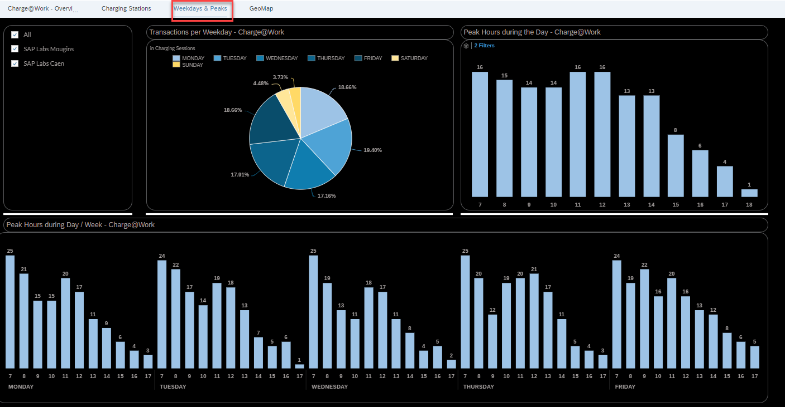

Exercise 4: Appendix

In this exercise have pre built the below charts

- Charging Stations

- Weekdays & Peaks

Please go through the visualisations present in the storyboard. Below is a brief sdescription of the visualisations.

#### **Charging Stations Story**

<!--- {width="5.65in" height="3.189583333333333in"} -->

Here you will see insights into **charging stations** in Mougins and Caen in which we charge the E-Vehicles of our colleagues and visitors every day.

This page is interactive - on the left side there are options for different KPI’s and changes will be reflected in the two graphs which are **Charging Station** and **Data per Period**. The options for measures are Consumption kWh, Inactivity(hr), Effective Charging(%) and Cost.

**Charging Station – Charge@Work**

·    Here we see the comparison of Charging Stations average duration in relation to the KPI chosen using the radio buttons in the Input control.

**Effective Charging (%)**

·    This is a static graph on this page. Effective Charging is a KPI that indicates the ratio between charging station being utilised and inactive.

**Data per Period**

·    The graph demonstrates the trend **over period** and reflects the measure selected on the top left corner (Consumption kWh, Inactivity, Effective Charging, and Cost)

### Weekdays & Peaks Story

On this page you will get an overview of the **weekdays and peak hours** of the charging sessions at Mougins and Caen.

**Transactions per Weekday**

·    This is a KPI in % to show the ratio of **charging sessions** across the week. In general on Saturdays and Sundays there are very few charging sessions and thus a low percentage here.

·    In some cases we can see that on Fridays we have much higher ratio for charging sessions as prior to the weekend employees want to make sure that their cars are charged. Therefore in this case we may need to incentives colleagues to charge on Thursday instead to balance out the demand.

**Peak Hours during the Day**

·    Here we see **peak times along the day** for the total time duration selected. We might incentives our colleagues to charge their cars in non-peak hours.

**Peak Hours during Day & Week**

·    Here we see **peak times along the day** and throughout the work week.
