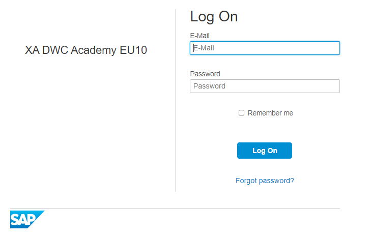
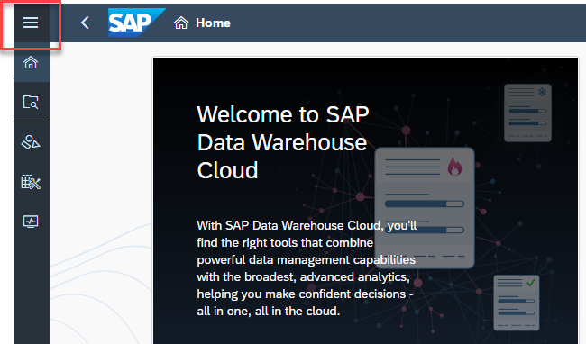
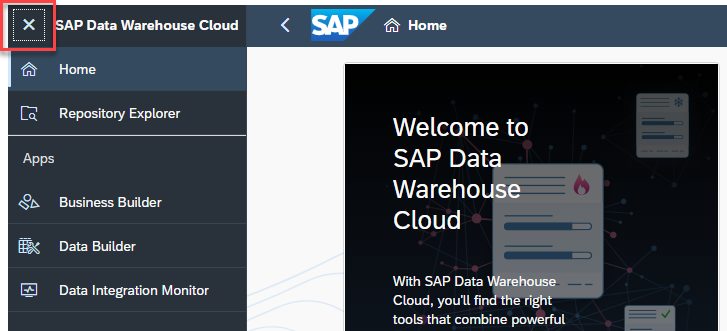

# Exercise 2:  Log On to SAP Data Warehouse Cloud 

## Log On to SAP Data Warehouse Cloud

1. Please begin by opening a Chrome browser and enter the SAP Data Warehouse Cloud URL provided from your Workshop organizers, via your registration confirmation e-mail.

   

2. Login with your user credentials. 

   

    

3. Expand the **Navigation Menu** in the top left corner to see the full list of features.

   

   

4. Collapse to hide the detail again.

   

   

5. In the middle of the screen, you’ll find some short cuts to the **Space Management**, **Data Builder**, and **Story Builder**, as well as an RSS feed of trending topics on SAP Data Warehouse Cloud. 

   

 

