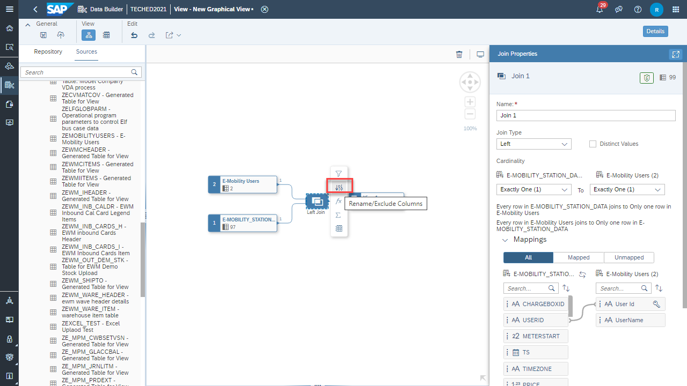
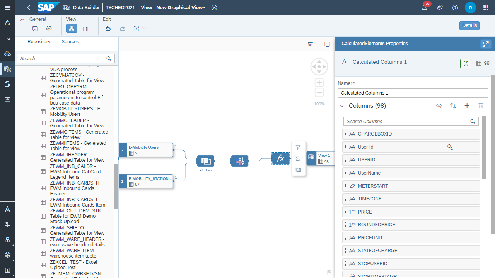
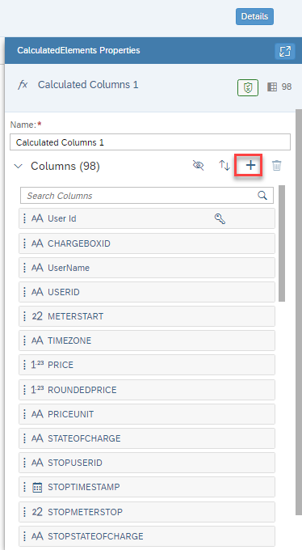
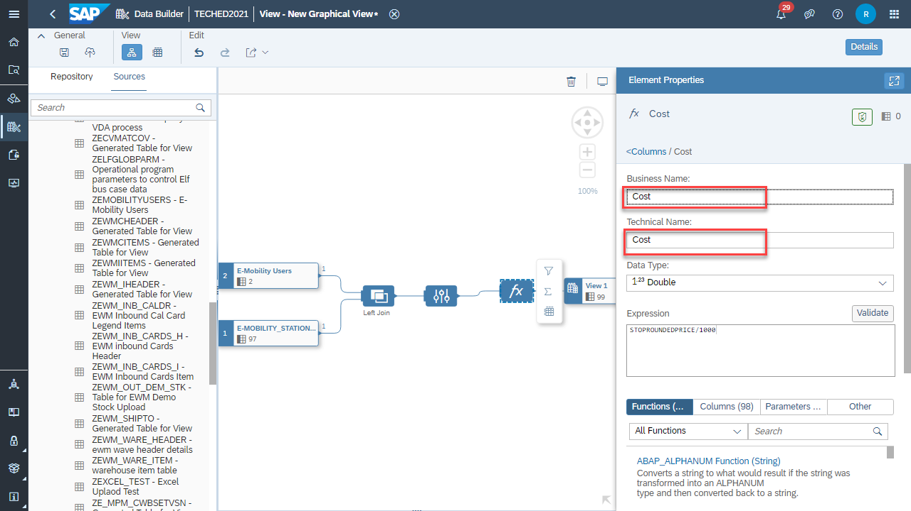
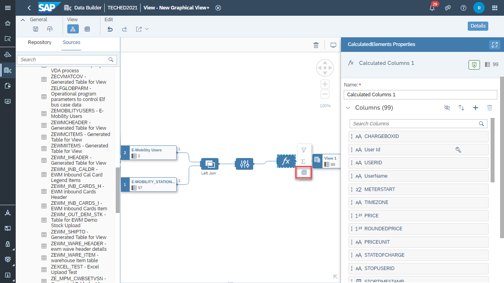
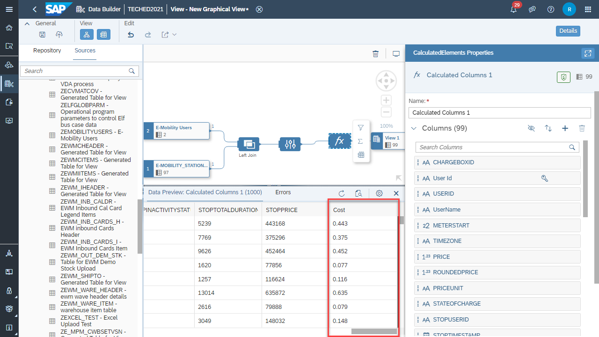
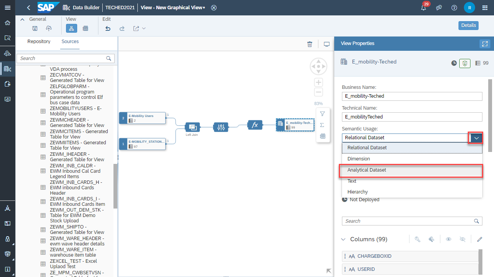
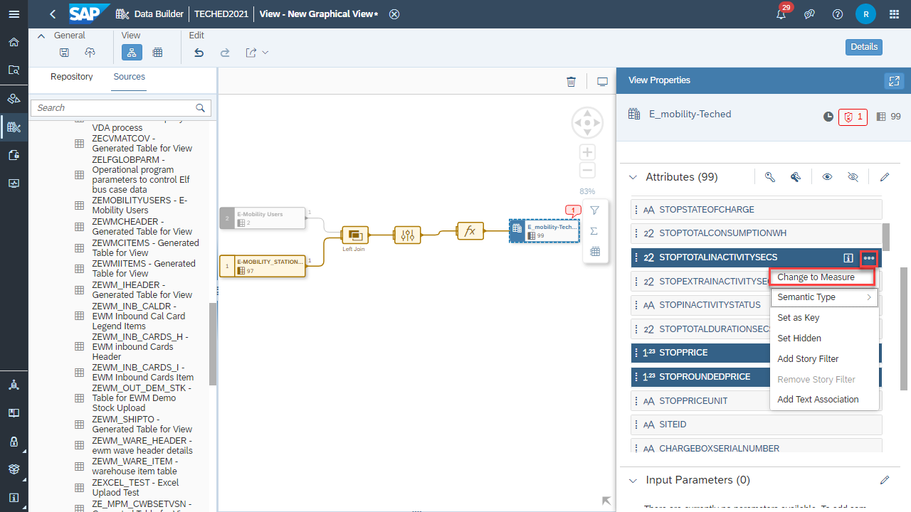
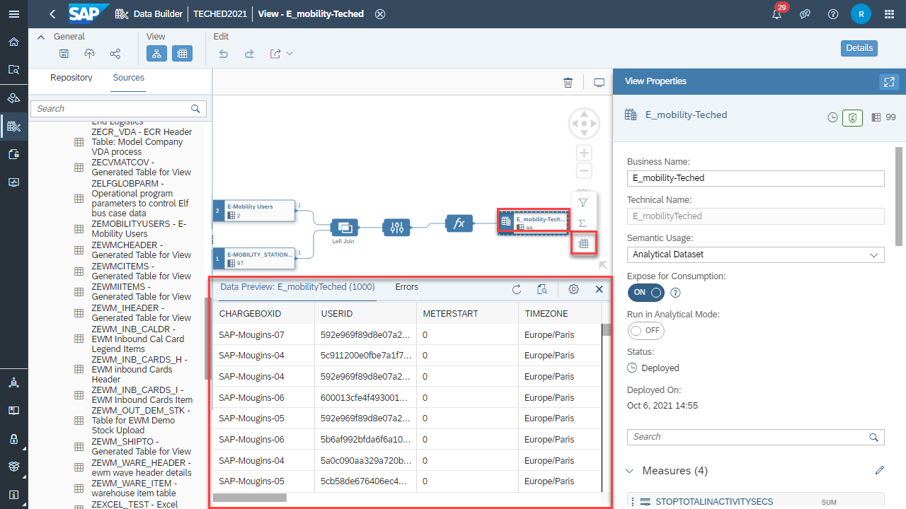

# Exercise 4: Projection, Formulas and View deployment

In this exercise we will introduce a projection to exclude columns, include a formula and deploy the view.

At the conclusion of this exercise your Graphical View will look similar to the image below

#### **Add a Projection**

1.  Click on the Join
2.  In the context click on **Rename/Exclude Columns (Projection)**

3. Click on  to Exclude TS Column.

> 

4. Click on Exclude Column.

5.Click on the **Projection**

6Click on the **Calculated Columns** from the context

7. Properties panel of the **fx** node is displayed

8. Click on the + icon to add a column

9. Click into the Expression box and type:

10. STOPROUNDEDPRICE/1000

11. Then, click Validate.

12. Change the Business Name as **Cost** and Technical Name as **Cost** for the Calculated Column

13. Click on Columns

14. Click on the Data Preview icon to see the newly added Calculated Column(**Cost)** data.

15. If we don't find the column in the preview, click on Column Settings, search for **Cost** then select **Cost** column from the list and Click OK.

16. Click on Data Preview.

17. Click on **View1** to change the View properties.

18. Do the following changes to the Properties of the View:

19. Enter Business Name as **E_mobility-Teched**

20. Enter the Technical Name as **E_mobility-Teched**

21.Change Semantic Usage from "Relational Dataset" to "Analytical Dataset".

22. Set "Expose for Consumption" to ON

23. Setting "Expose for Consumption" makes the artifact available for consumption in the SAP Analytics Cloud for Story Building (Analytical Dataset Views only) and other analytical clients.

24. We are now going to select the measures

25. Can use the search bar to find the measures

26. With Control key pressed + Left mouse click on "STOPTOTALINACTIVITYSECS","STOPPRICE","STOPROUNDEDPRICE","Cost"

27. Click on the 3 dots (...)

28. Click on "Change to Measure".

> **OR** you can click on the "STOPTOTALINACTIVITYSEC", "STOPPRICE" "STOPROUNDEDPRICE","Cost" for each of the attributes and select **Change to Measure**.

29. Click on Save

30. Click on Save

32. Now you can "Deploy" the Data Model.

33. Click "Deploy".

34. Check the Deployed status

35. Click on the output data set 'E_mobility-Teched'

36. From the context click on Data Preview to see the data.

[Exercise 5. Spatial Reference](../ex2/Spatial_reference.md)